# MCP Senaryoları

Bu dokümanda MCP Server örneğine ait iki senaryo gösterilmektedir. Bu senaryolar uygulamanın iş süreçlerine dair fonksiyonellikleri ele alır. Deneysel bir çalışma olduğundan VS Code arabirimi kullanılmıştır. Gerçek hayat senaryosunda ayrı bir istemci uygulama üzerinden bu senaryoların işletilmesi beklenir.

## Senaryo 1: Var Olan Bir Müşteri İçin Opsiyonlama

Bu senaryoda sistemde kayıtlı olan bir müşteri için yine sistemde var olan araçlardan birisinin satın alma opsiyonlu olarak ayrılması söz konusudur. Yetkili personel *(ki bu denemede VS Code kullanan geliştirici :D)* şöyle bir prompt girer.

```text
Alvo Yarnsby için yeni bir araç opsiyonlamak istiyorum.
```

Buna göre VS Code sorulan soruyla ilgili bir MCP server olup olmadığına bakar ve ilgili aracı keşfettikten sonra olaylar aşağıdaki gibi gelişir.

Vekil ajan müşteri bilgisini ilgili MCP tool üstünden arar ve bulur. Ayrıca araç listesinden opsiyonlanabilecek olan araçların bir listesini seçilmek üzere getirir.

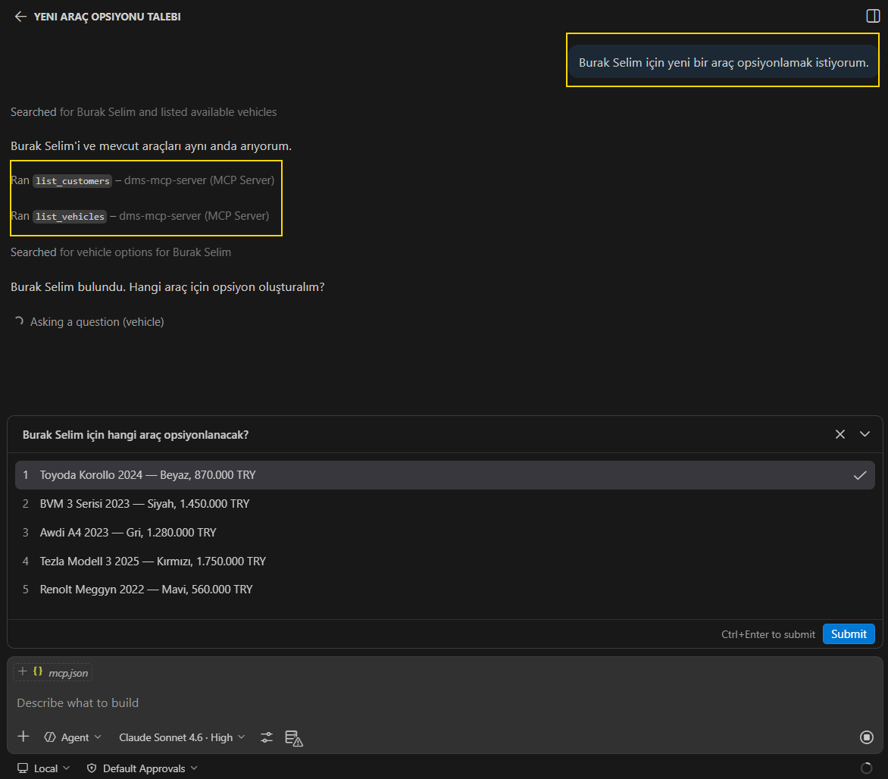

Opsiyonlanacak araç seçimi sonrası bununla ilgili aracın çalıştırılması için bir izin de istenir.

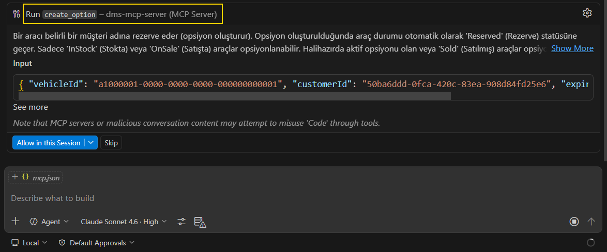

Bu sırada tool ile gelen bir eksik fark edilir. Opsiyonlama için süre de belirtilmelidir. Bunun üzerine vekil ajan tekrar devreye girer ve bu bilgiyi de sorar. Vay arkadaş.

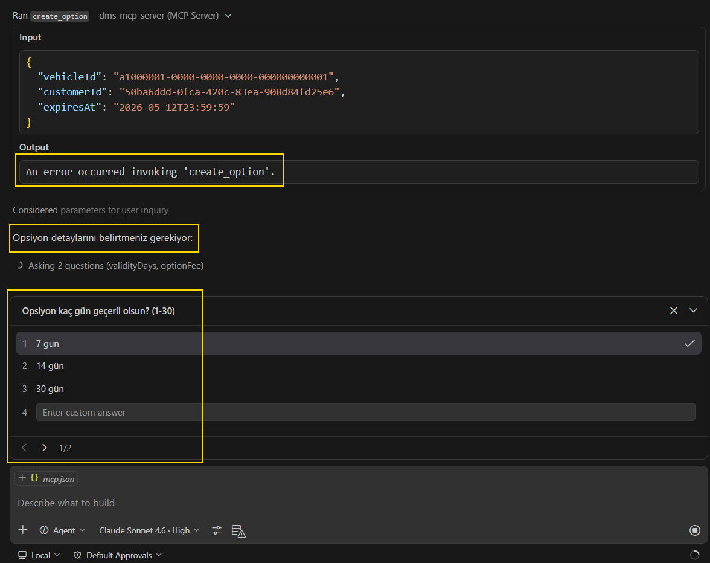

Hatta opsiyonlama için birde kapora ücreti gerekir. Bedavaya araç verecek değiliz :D Ki bu da vekil ajanın keşfettiği tool'un bir paramtresidir. O da sorulur ve eklenir.

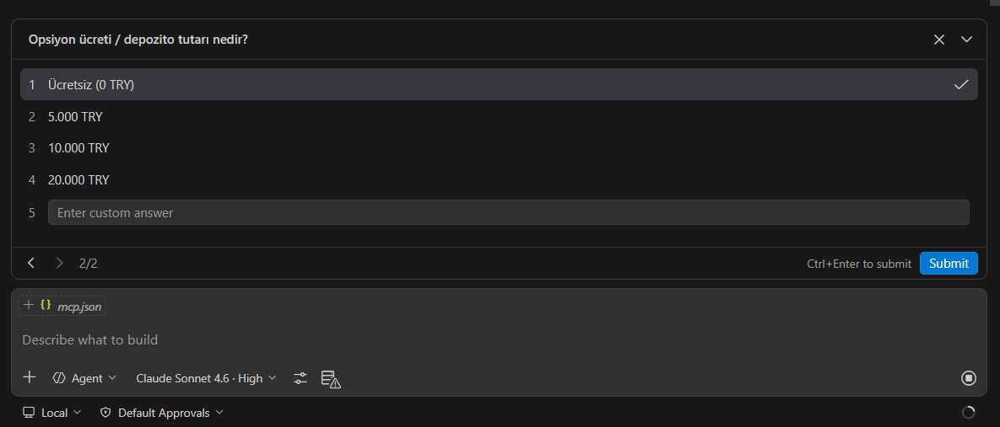

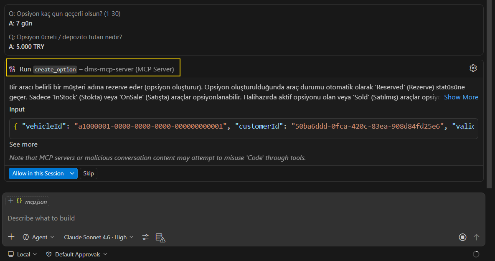

Burada vekil ajanın yetki talebine tüm session boyunca izin verilmesi de gündemdedir ama kontrol emin olana kadar sizde olsun derim ;)

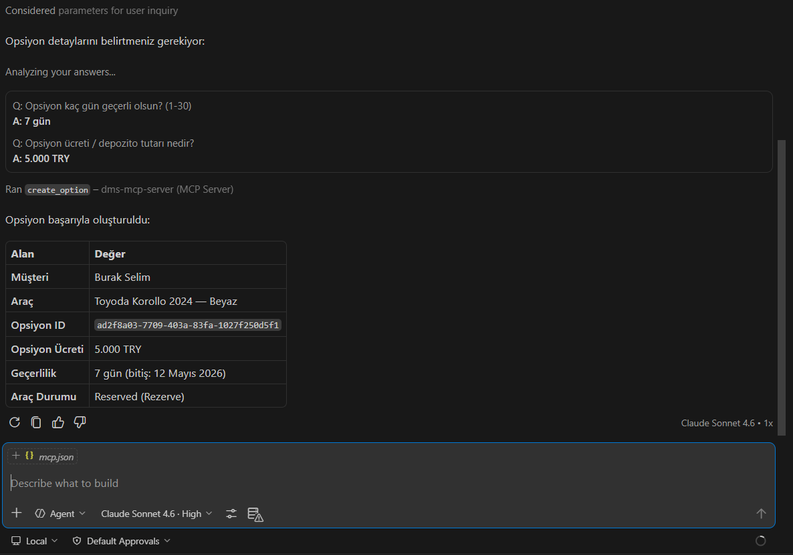

## Senaryo 2: Yeni Bir Müşteri İçin Araç Opsiyonlama

Bu seferki senaryoda ise sistemde kayıtlı olmayan bir müşteri için araç opsiyonlama süreci ele alınır. MCP server'ın bu seferki görevi müşteri kaydı oluşturmak ve ardından araç opsiyonlama sürecini işletmektir. Yine yetkili personel *(Kahramanımız VS Code geliştiricisi :D)* aşağıdaki prompt'u girer.

```text
Spidi Gonzalez için bir araç opsiyonlamak istiyorum.
```

Vekil ajan daha önceden olduğu gibi soruyu şıp diye anlar ve bu konuyla ilgili MCP Server'a başvurur.

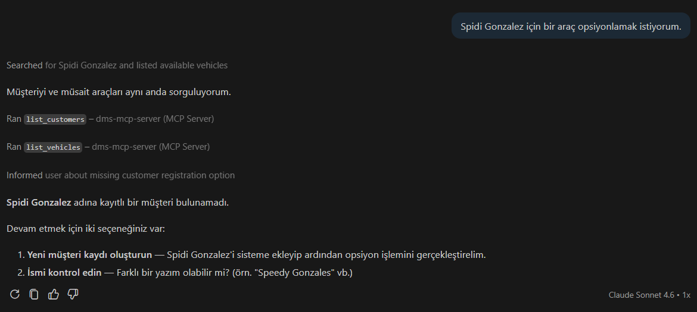

İlk tespiti sistemde `Spidi Gonzalez` adında bir müşteri kaydı olmadığıdır. Bunun üzerine yeni bir müşteri kaydı oluşturmak veya hatalı bir isim yazıp yazmadığımızdan *(pek de becerikli)* emin olmak için iki seçenek sunar. *(Yapay zeka işimizi elimizden alacak diyenler 1' bassın, diğerleri 2'ye bassın :D)*

Neyse neyse... Yeni müşteri kaydı aslında hızlı müşteri kaydı işlemidir. Kampanya bilgisi göndermek lazım olabilir zira ;) O yüzden en azından bir e-mail ve telefon bilgisi almak istenir. Vekil ajan bu bilgileri sırasıyla sorar. Hatta geliştirdiğimiz deneysel sistemde bireysel ve kurumsal müşteri ayrımı olduğu için müşteri tipi de sorulur.

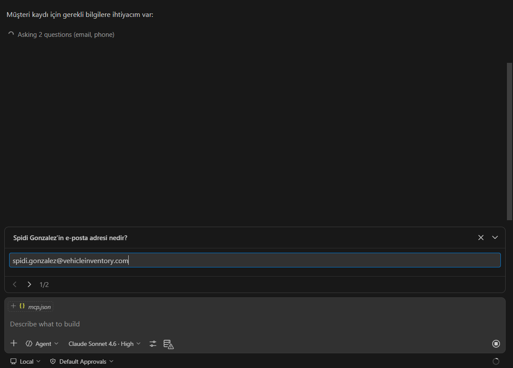

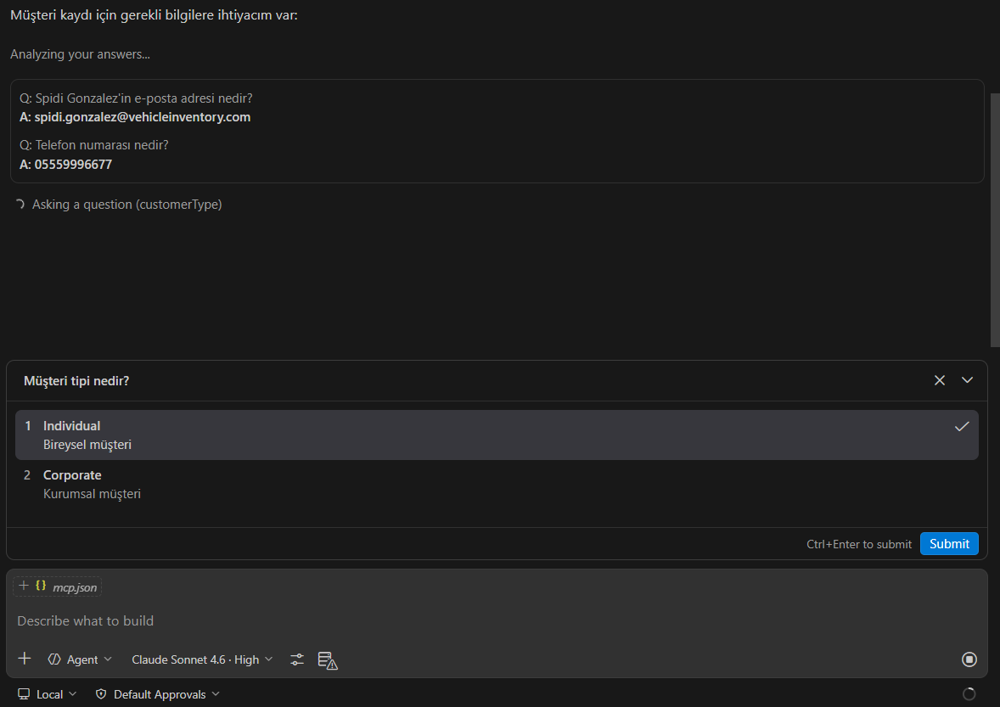

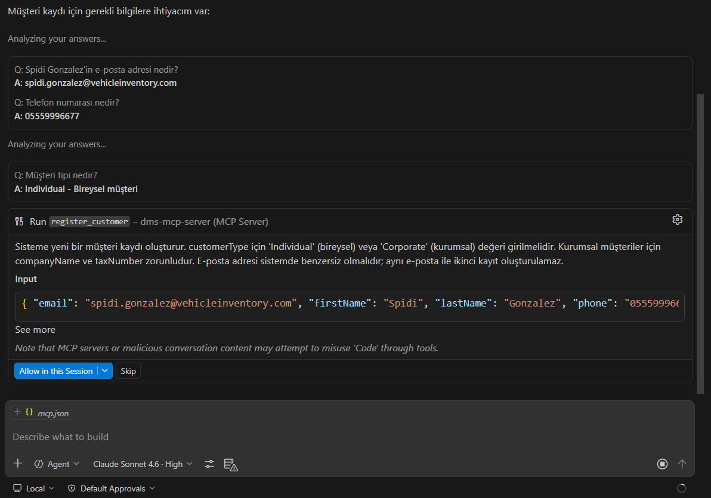

Tabi burada da yapılmak istenen işlem bir dış API Post çağrısı ile müşteri kaydı oluşturmak olduğundan bir yetki talebinde de bulunulur.

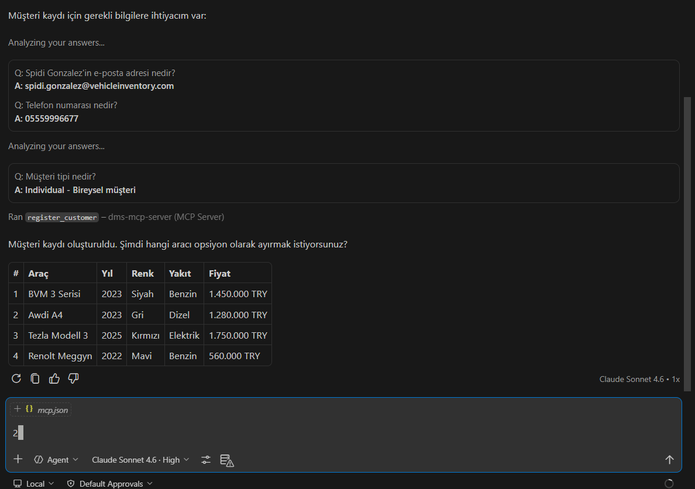

Müşteri kaydı da başarılı şekilde oluşturulduktan sonra sırada araç opsiyonlama süreci vardır. Bu süreç de senaryo 1'deki gibi işler. Araç seçilir, süre ve kapora bilgisi alınır ve opsiyonlama işlemi tamamlanır.

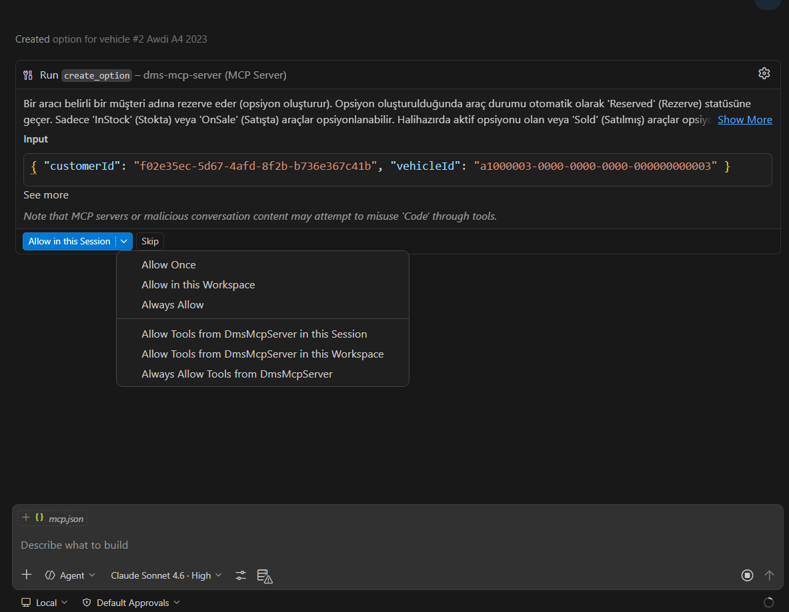

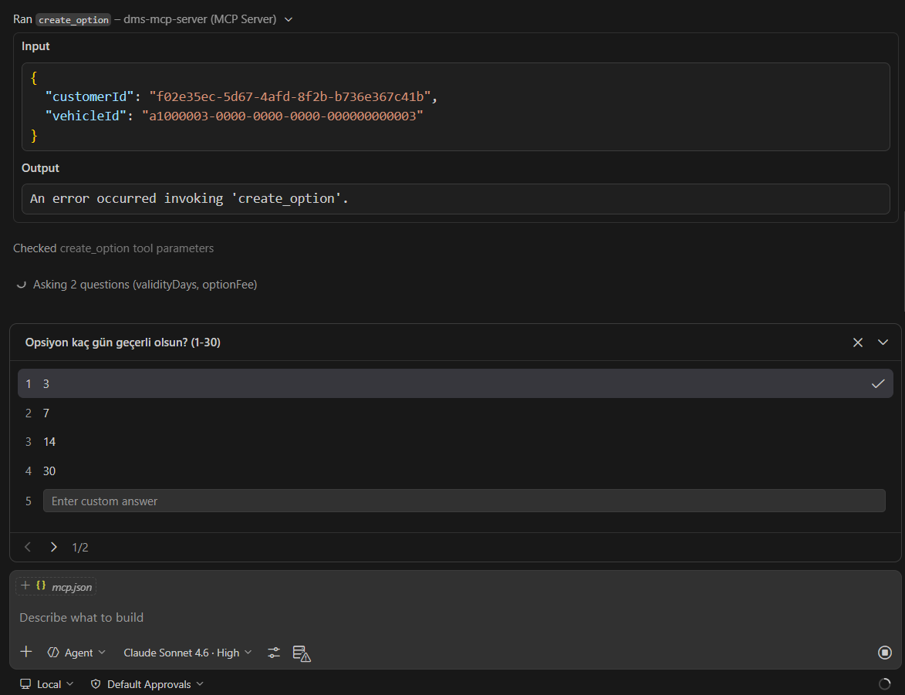

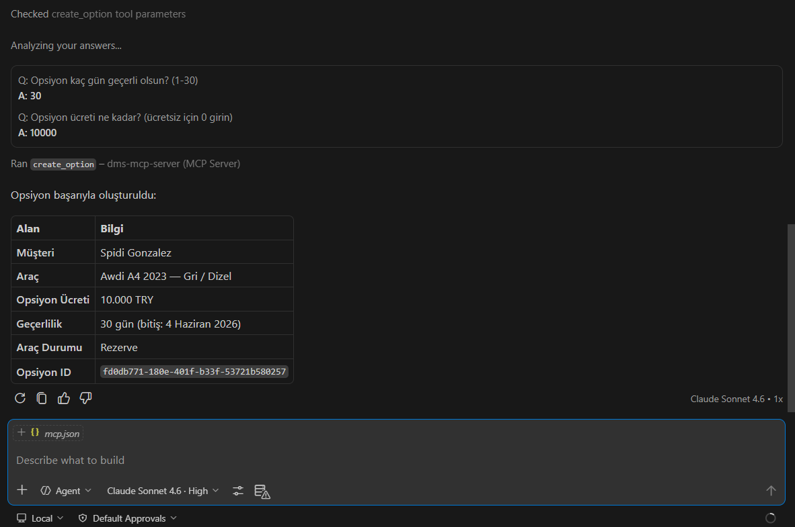
