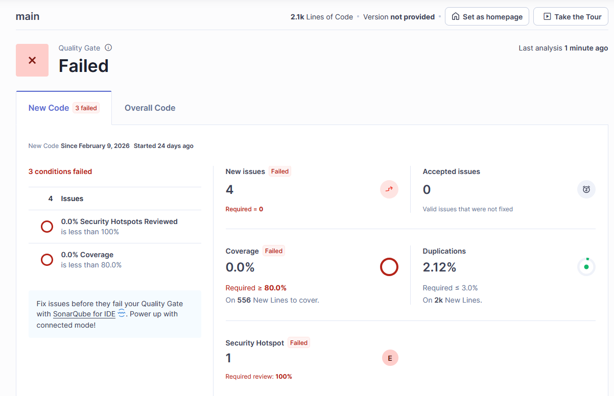
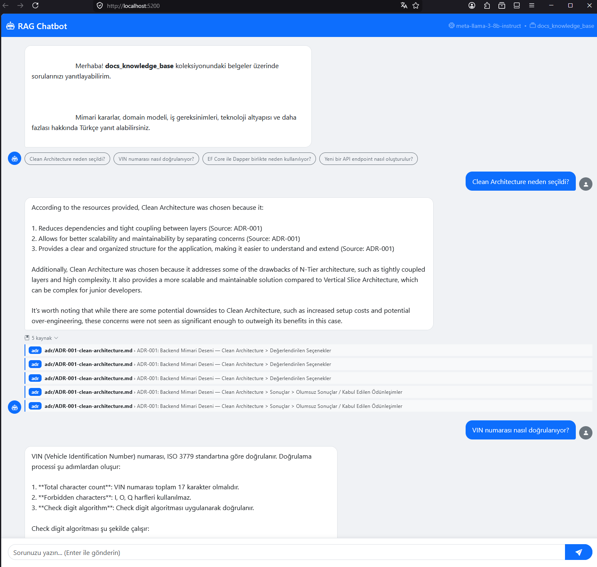
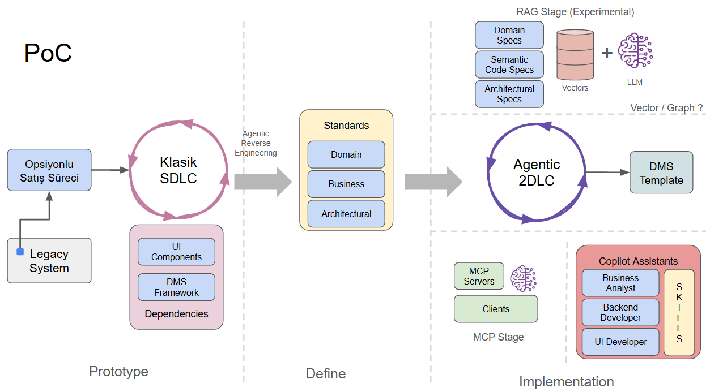
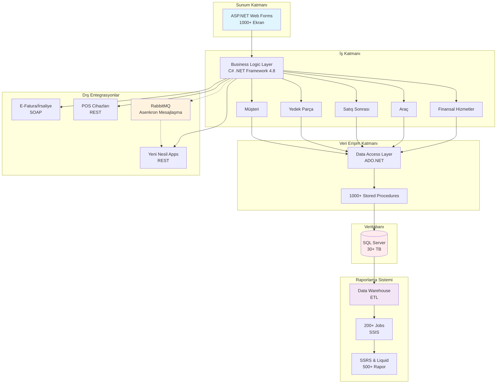
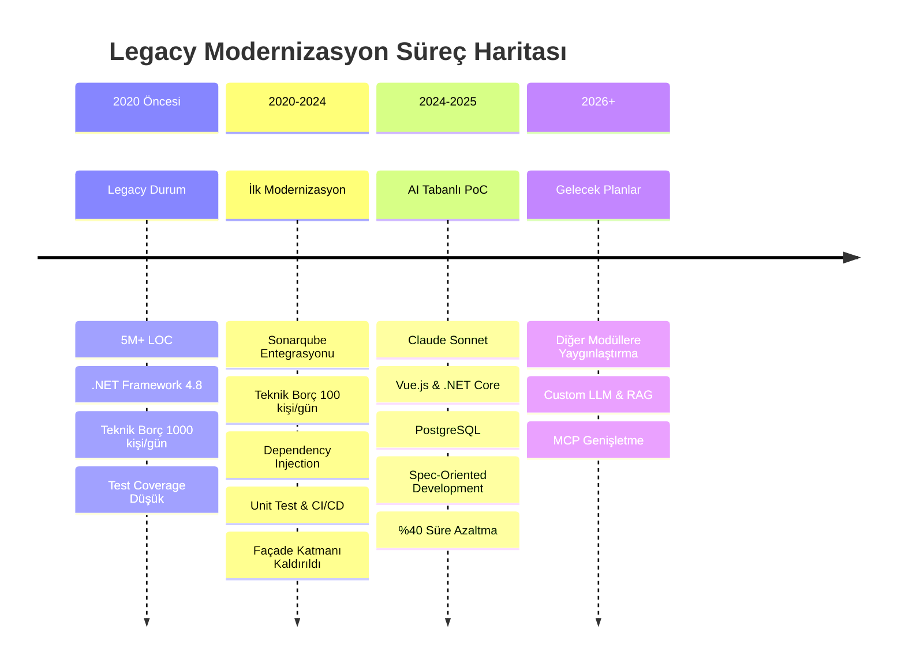
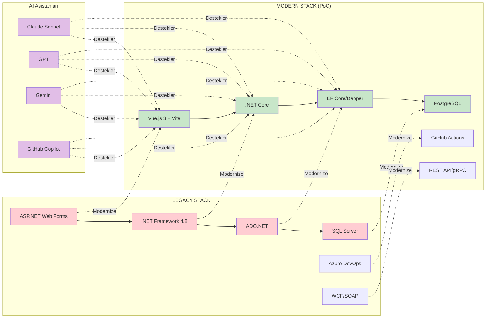
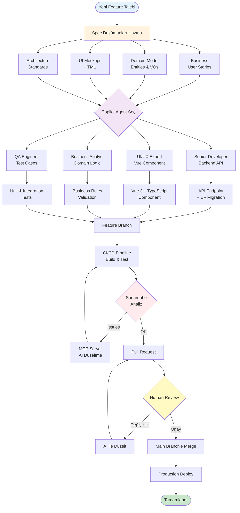

# Yapay Zeka, Yılların Koduna Karşı: AI Tabanlı Legacy Modernizasyonu

Legacy bir sistemi modernize etmek için yapay zeka teknolojilerinden nasıl yararlanıyoruz, ne gibi zorluklarla karşılaşıyoruz ve vardığımız sonuçlar...

- [Hızlı Başlangıç](#hızlı-başlangıç)
  - [Ön Gereksinimler](#ön-gereksinimler)
  - [Hazırlıklar](#hazırlıklar)
  - [Veritabanı Migration](#veritabanı-migration)
  - [Vehicle Inventory Web Uygulaması](#vehicle-inventory-web-uygulaması)
  - [RAG](#rag)
  - [MCP](#mcp)
  - [SonarQube](#sonarqube)
    - [Backend projesini analiz etme (.NET Scanner)](#backend-projesini-analiz-etme-net-scanner)
    - [Frontend projesini analiz etme (SonarScanner CLI)](#frontend-projesini-analiz-etme-sonarscanner-cli)
- [Legacy System](#legacy-system)
  - [Metriklerle Legacy Sistemimiz](#metriklerle-legacy-sistemimiz)
  - [Teknoloji Altyapısı](#teknoloji-altyapısı)
  - [Sistemdeki Genel Problemler (2020 Öncesi)](#sistemdeki-genel-problemler-2020-öncesi)
  - [Birincil Modernizasyon Çalışmaları (2020 - 2024)](#birincil-modernizasyon-çalışmaları-2020---2024)
  - [Motivasyon](#motivasyon)
  - [Riskler](#riskler)
- [Level 0: Birinci Aşama](#level-0-birinci-aşama)
  - [Geliştirme Süreci](#geliştirme-süreci)
  - [Strateji](#strateji)
  - [Deneyimler](#deneyimler)
- [Sonarqube Taramaları](#sonarqube-taramaları)
  - [Sonarqube Taraması için Notlar](#sonarqube-taraması-için-notlar)
- [RAG (Retrieval Augmented Generation) Düzeneği](#rag-retrieval-augmented-generation-düzeneği)
- [MCP (Model Context Protocol) Düzeneği](#mcp-model-context-protocol-düzeneği)
- [Teknik Özet](#teknik-özet)
- [PoC Çalışma Stratejisi](#poc-çalışma-stratejisi)
- [Sonuçlar](#sonuçlar)
- [Sonraki Planlar ve Hedefler](#sonraki-planlar-ve-hedefler)
  - [Güncelleme: Nisan 2026](#güncelleme-nisan-2026)
- [Yardımcı Diagramlar](#yardımcı-diagramlar)
  - [Legacy Sistem Mimarisi](#legacy-sistem-mimarisi)
  - [Modernizasyon Yol Haritası](#modernizasyon-yol-haritası)
  - [PoC Modernizasyon Stack Karşılaştırması](#poc-modernizasyon-stack-karşılaştırması)
  - [Spec-Oriented Development Akış Diyagramı](#spec-oriented-development-akış-diyagramı)
- [Demo Simülasyonu](#demo-simülasyonu)
  - [Repo Yapısı](#repo-yapısı)
  - [Dokümanlar](#dokümanlar)
  - [GitHub Copilot Ajanları](#github-copilot-ajanları)
  - [Skill'ler](#skilller)
  - [Ajan-Skill İlişki Matrisi](#ajan-skill-i̇lişki-matrisi)
  - [Geliştirme Yaparken](#geliştirme-yaparken)
  - [Notlar](#notlar)

## Hızlı Başlangıç

Bu bölüm, repository'deki tüm projeleri yerel ortamda ayağa kaldırmak için gereken adımları içermektedir. Doküman içinde kaybolmayıp doğrudan aksiyona geçmek isteyen geliştiricileri buradan başlamasını öneririm :D

### Ön Gereksinimler

Aşağıdaki araçların sisteminizde kurulu ve çalışır durumda olması gerekiyor:

| **Araç** | **Sürüm** | **Açıklama** |
| --- | --- | --- |
| [.NET SDK](https://dotnet.microsoft.com/download) | 10.0+ | Backend ve araç projeleri |
| [Node.js](https://nodejs.org/) | 22 LTS+ | Frontend derleme ortamı |
| [Yarn](https://yarnpkg.com/) | 1.22+ | Frontend paket yöneticisi |
| [Docker Desktop](https://www.docker.com/products/docker-desktop/) | 4.x+ | Altyapı servisleri (PostgreSQL, Qdrant, SonarQube vb.) |
| [LM Studio](https://lmstudio.ai/) | Son sürüm | RAG ve Text Embedding için yerel LLM sunucusu |

> **Not:** Ben Frontend tarafında Windows native binding uyumsuzluklarına takıldığım için `npm` yerine `yarn` kullanmayı tercih ettim.

### Hazırlıklar

**1. Repository'yi klonlayın:**

```bash
git clone https://github.com/<kullanici>/dot-net-conf-2026.git
cd dot-net-conf-2026
```

**2. Docker ile altyapı servislerini başlatın:**

Tüm altyapı servisleri *(PostgreSQL, pgAdmin, RabbitMQ, SonarQube, Qdrant)* tek komutla ayağa kaldırılabilir.

```bash
docker compose up -d
```

Başlatılan servisler ve erişim adresleri ise aşağıdaki gibidir.

| **Servis** | **Adres** | **Kullanıcı / Şifre** |
| --- | --- | --- |
| **PostgreSQL** | `localhost:5433` | `johndoe` / `somew0rds` |
| **pgAdmin** | `http://localhost:5052` | `scoth@tiger.com` / `123456` |
| **RabbitMQ Management** | `http://localhost:15673` | `guest` / `guest` |
| **SonarQube** | `http://localhost:9001` | `admin` / `admin` |
| **Qdrant REST API** | `http://localhost:6333` | — |

> PgAdmin arabirimi yerine DBeaver gibi bir araç da kullanılabilir.

**3. Frontend bağımlılıklarını yükleyin:**

```bash
cd src/frontend
yarn install
```

### Veritabanı Migration

Veritabanı tarafındaki tabloların oluşturulması ve hatta örnek verilerin eklenmesi için bu adım gerekli. Migration işlemleri `VehicleInventory.API` projesinin bulunduğu klasörden ya da solution kök dizininde çalıştırılabilir.

**ef** komutunu işletebilmek için sisteminizde `dotnet-ef` aracının kurulu olması gerekir. Eğer kurulu değilse aşağıdaki komutla global olarak kurabilirsiniz:

```bash
dotnet tool install --global dotnet-ef
```

**Migration planı oluşturma:**

```bash
cd src/backend
dotnet ef migrations add <MigrationAdi> --project VehicleInventory.Infrastructure --startup-project VehicleInventory.API
```

Örnek:

```bash
dotnet ef migrations add InitialCreate --project VehicleInventory.Infrastructure --startup-project VehicleInventory.API
```

**Mevcut migration'ları listeleme:**

```bash
dotnet ef migrations list --project VehicleInventory.Infrastructure --startup-project VehicleInventory.API
```

**Migration'ları veritabanına uygulama:**

```bash
dotnet ef database update --project VehicleInventory.Infrastructure --startup-project VehicleInventory.API
```

**Seed verilerini yükleme:**

Migration tamamlandıktan sonra `scripts/seed-data.sql` dosyasını pgAdmin veya `psql` ile çalıştırabilirsiniz ya da dosya içerisinde yazdığı gibi doğrudan docker üzerinden de işletebilirsiniz.

```bash
psql -h localhost -p 5433 -U johndoe -d VehicleInventory -f scripts/seed-data.sql

# Docker kullanarak ekletmek için
# PowerShell
Get-Content scripts/seed-data.sql | docker exec -i aio-postgres psql -U johndoe -d VehicleInventory

# Linux/macOS
docker exec -i aio-postgres psql -U johndoe -d VehicleInventory < scripts/seed-data.sql
```

### Vehicle Inventory Web Uygulaması

Uygulama bir **.NET 10 backend API** ve bir **Vue 3 + Vite frontend**'den oluşmaktadır.

**Backend API'yi başlatın:**

```bash
cd src/backend/VehicleInventory.API
dotnet run
```

API şu adreste çalışır: `http://localhost:5280`
Swagger UI: `http://localhost:5280/swagger`

**Frontend geliştirme sunucusunu başlatın** (ayrı bir terminal):

```bash
cd src/frontend
yarn dev
```

Frontend şu adreste çalışır: `http://localhost:5173`

### RAG

**RAG** çözümü iki ayrı uygulamadan oluşmaktadır: **DocChunker** (dokümanları vektör veritabanına yükler) ve **ChatApp** (Razor Pages tabanlı bir sohbet arayüzü sağlar).

**Ön koşul — LM Studio:**

Ben denemeleri gerçek API noktalarına gitmek yerine deneysel olduğu için yerel makinede çalışan LM Studio üzerinden gerçekleştirdim. Öncelikle LM Studio'yu başlatın ve aşağıdaki modelleri yerel sunucuya yükleyip aktif edin. Ancak bunlar şart değil, daha iyi ve etkin modeller seçebilirsiniz. Makinenizin gücüne bağlı olarak çok yüksek parametreleri modelleri de deneyebilirsiniz.

- Embedding modeli: `text-embedding-nomic-embed-text-v1.5`
- Chat modeli: `meta-llama-3-8b-instruct`

Genelde **LM Studio** sunucusu `http://localhost:1234/v1` adresi üzerinden çalışır.

**1. Adım — Dokümanları Qdrant'a yükleyin (DocChunker):**

```bash
cd RAG/DocChunker
dotnet run
```

Bu komut `docs/` klasöründeki Markdown dosyalarını parçalara *(chunk)* böler, embedding oluşturur ve Qdrant koleksiyonuna (`docs_knowledge_base`) yazar.

> Bu deneysel çalışmada Vector RAG mimarisi baz alınmıştır. Çok daha iyi bağlamlar sağlamak için Graph RAG konusuna bir bakın derim.

**2. Adım — ChatApp'i başlatın:**

```bash
cd RAG/ChatApp
dotnet run
```

ChatApp şu adresten ayağa kalkar: `http://localhost:5200`

### MCP

**DmsMcpServer**, VS Code GitHub Copilot Agent entegrasyonu için `Streamable HTTP` standardı üzerinden çalışan bir MCP sunucusudur. Backend API'ye bağlanır.

**Ön koşul:** Backend API'nin çalışıyor olması gerekir (`http://localhost:5280`).

**MCP sunucusunu çalıştırmak için** VS Code `.vscode/mcp.json` (veya Copilot ayarları) üzerinden aşağıdaki yapılandırma ayarlarının verilmesi gerekir.

```json
{
    "servers": {
        "dms-mcp-server": {
            "type": "http",
            "url": "http://localhost:5290/mcp"
        }
    }
}
```

Manuel olarak test etmek için:

```bash
cd MCP/DmsMcpServer
dotnet run
```

Sonrasında MCP Server başlatılır ve VS Code arabiriminde bir ajan seçilip örnek bir istekte bulunulur.

```text
Envanterden bir Satışta aracı al, Alvo Yarnsby adlı müşteri için 7 günlük opsiyon oluştur.
```

### SonarQube

Projelerdeki teknik borçlanmaya ölçümlemek için kullanılan SonarQube, `docker compose up -d` komutuyla otomatik olarak başlatılır ve `http://localhost:9001` adresinden çalışır.

**İlk giriş:** `admin` / `admin` *(ilk girişte şifre değişikliği istenir)*

**Proje oluşturma ve analiz token'ı alma:**

1. `http://localhost:9001` adresine gidin ve oturum açın.
2. **Projects → Create Project → Manually** yolunu izleyin.
3. Proje adı olarak `VehicleInventory` girin.
4. **Locally** seçeneğini seçin ve bir token oluşturun (örn. `sqa_...`).

#### Backend projesini analiz etme (.NET Scanner)

```bash
cd src/backend

# SonarQube scanner'ı başlat
dotnet sonarscanner begin \
  /k:"VehicleInventory" \
  /d:sonar.host.url="http://localhost:9001" \
  /d:sonar.token="<SONARQUBE_TOKEN>"

# Projeyi derle
dotnet build VehicleInventory.slnx

# Analizi tamamla ve sonuçları yükle
dotnet sonarscanner end /d:sonar.token="<SONARQUBE_TOKEN>"
```

> `<SONARQUBE_TOKEN>` değerini SonarQube arayüzünden oluşturduğunuz token ile değiştirin.

**`dotnet-sonarscanner` global aracı kurulu değilse:**

```bash
dotnet tool install --global dotnet-sonarscanner
```

#### Frontend projesini analiz etme (SonarScanner CLI)

Frontend (Vue 3 + TypeScript) projesini analiz etmek için SonarScanner CLI kullanılır. `src/frontend/` klasöründe `sonar-project.properties` dosyası mevcuttur; proje adı, kaynak dizin, SonarQube adresi ve token gibi tüm ayarlar bu dosyada tanımlıdır.

```text
# src/frontend/sonar-project.properties
sonar.projectKey=Vehicle-Inventory-Frontend
sonar.projectName=Vehicle Inventory Frontend
sonar.host.url=http://localhost:9001
sonar.token=<SONARQUBE_TOKEN>
sonar.sources=src
sonar.exclusions=**/node_modules/**,**/dist/**,**/*.spec.ts,**/*.test.ts
sonar.javascript.lcov.reportPaths=coverage/lcov.info
sonar.typescript.tsconfigPath=tsconfig.app.json
```

> `sonar.token` değerini SonarQube arayüzünden oluşturduğunuz token ile güncelleyin. Frontend için SonarQube'da `Vehicle-Inventory-Frontend` adıyla ayrı bir proje oluşturmanız gerekir.

**`sonar-scanner` global aracı kurulu değilse:**

```bash
npm install -g sonarqube-scanner
```

**Analizi çalıştırın** (`src/frontend/` dizininden):

```bash
cd src/frontend
sonar-scanner
```

`sonar-project.properties` dosyası sayesinde ek parametre vermek gerekmez; scanner tüm ayarları bu dosyadan okur.

**Test coverage raporu dahil etmek için** (opsiyonel):

Önce Vitest ile coverage raporu üretin, ardından analizi çalıştırın:

```bash
yarn test --coverage
sonar-scanner
```

Bu sayede SonarQube kod kalitesinin yanı sıra test coverage değerlerini de raporlar.

---

## Legacy System

Milenyum başında geliştirilmeye başlanmış olan bayi yönetimi sistemi *(Dealer Management System - DMS)*, tamamen **Microsoft .NET** teknolojileri üzerine kurgulanmıştır. Bu nedenle .NET Framework'ün zaman içerisindeki değişimine bağlı olarak yer yer modernize edilmiş ve güncellenmiştir. Şu anda **.NET Framework 4.8** sürümünü kullanmaktadır. Sistem, bayi operasyonlarını yönetmek için kritik öneme sahip birçok modül içermektedir. Tabii Microsoft'un .NET Framework için olan desteği 2029 yılında sona erecektir. Bu nedenle, sistemin gelecekteki sürdürülebilirliği için modernizasyon kaçınılmazdır.

Genel olarak katmanlı mimari *(Layered Architecture)* modeline göre düzenlenmiş bir sistemdir. **Presentation**, **Business Logic Layer** ve **Data Access Layer** olmak üzere üç ana katmandan oluşan bir mimari üzerine kurgulanmıştır. Daha önceden var olan **Façade** katmanı ilk modernizasyon çalışması kapsamında kaldırılmıştır. Sistem **Microsoft SQL Server** veritabanını kullanmaktadır. İş kuralları ve süreçler modül bazında yer yer karmaşık ve içiçe geçmiştir. Bunun en büyük sebeplerinden birisi **stored procedure** performans avantajlarıdır. Kaldı ki raporlama ve planlı işlerin büyük çoğunluğu veri üzerinde işlediğinden SP'ler önemli bir yere sahiptir. Dolayısıyla kod ve veritabanına yayılmış iş kuralları ve süreçleri mevcuttur.

Onlarca yıllık bir uygulama söz konusu olduğundan toplam satır sayısı neredeyse altı milyonu geçen bir kod tabanı söz konusudur. Binlerce ekran, yüzlerce stored procedure, tera baytlarca veri, onlarca servis beş ana modül etrafında birleşir. Bu modüller finansal hizmetler, araç yönetimi, satış sonrası hizmetler, yedek parça ve müşteri olarak sıralanabilir. Sistem, yüzlerce bayi tarafından kullanılmakta olup milyonlarca müşteriye hizmet vermektedir.

Sistemle entegre çalışan birçok uygulama vardır. Örneğin ayrı bir raporlama sistemi bulunmaktadır. Bu sistem **Data Warehouse** mimarisi üzerine kurulmuş olup, **ETL** süreçleriyle ana sistemden veri çekmektedir. Raporların hazırlanması için planlanmış işler *(Scheduled Jobs)* kullanılır. Onlarca Job vardır ve bunlardan bazılarının çalışma süresi saatler mertebesindedir. Job'ların çoğu doğrudan **Stored Procedure** işletmekle kimisi de Microsoft'un **SSIS** *(SQL Server Integration Services)* hizmetleri şeklinde çalıştırılmaktadır. Bazı raporlar anlık üretilebilen türdedir ve bunlar için **Liquid rapor** motoru kullanılmaktadır. Daha önceki dönemlerde Microsoft'un SSRS *(Microsoft SQL Server Reporting Services)* raporları da kullanılmıştır.

Sistem aynı zamanda regülasyonlar içeren dış servislere de bağımlılıklar içerir. Örneğin, elektronik faturalama ve irsaliye sistemleri, POS tabanlı ödeme cihazları, kurum için yazılmış yeni nesil uygulamalar vb. Bu sistemlerle haberleşme için ağırlıklı olarak **SOAP** ve **REST** tabanlı web servisleri kullanılmaktadır. Ana sistemden dışarıya açılan fonksiyonelliklerde **XML Web Servisler** ve **WCF servisleri** ağırlıktadır. Ayrıca yeni nesil uygulamaların ihtiyaç duyduğu veya karşılıklı olarak dahil olunması gereken süreçlerde asenkron mesajlaşma altyapısı bulunmaktadır. Bunun için **RabbitMQ** tercih edilmiştir. Modüller de kendi aralarında kullandığı ortak süreçlere sahiptir. Ortak ve tek bir veritabanı sistemi olduğundan modüller arası veri paylaşımı doğrudan veritabanı katmanından ve iş nesneleri üzerinden yapılmaktadır.

Uygulamanın dağıtımı ilk zamanlarda kurum içi geliştirilmiş bir uygulama tarafından zaman bazlı planlamalara bağlı kalınarak yapılmaktaydı. Son yıllarda yapılan modernizasyon çalışmaları kapsamında **DevOps** prensiplerine uygun olarak **Azure DevOps** üzerinden yürütülmektedir. **Git** tabanlı repolar kullanılmakta olup ve **CI/CD** süreçleri **Azure DevOps Pipelines** ile yönetilmektedir. **Branch** stratejisi olarak **Git Flow** tercih edilmiştir. Buna göre **feature** bazlı geliştirmeler yapılmakta, sprint bazlı **release**'ler oluşturulmakta ve ana branch'lere merge edilmektedir. Tüm bu işlemlerde **Code Review** ve **Pull Request** öncelikli geçiş kapıları yer almaktadır. Ayrıca dağıtım hattı üzerinde koşan statik kod tarayıcıları ve yapay zeka destekli bulgu yoklayıcılar kod kalitesini belli bir çıtanın üstünden tutmak üzere devrededir.

### Metriklerle Legacy Sistemimiz

Aşağıdaki tablo sistemdeki bazı metrikleri özetlemekte ve ne kadar devasa bir organizasyon olduğunu göstermektedir.

| **Metrik** | **Değer** |
| --- | --- |
| **Kod Satırı Sayısı** | 6,000,000+ |
| **Ekran Sayısı** | 1,000+ |
| **Stored Procedure Sayısı** | 10,000+ |
| **Veri Tabanı Boyutu** | >30 TB |
| **Entegre Uygulama Sayısı** | 50+ |
| **Kullanıcı Sayısı** | 10,000+ |
| **Modül Sayısı** | 5 |
| **Rapor Sayısı** | 500+ |
| **Job Sayısı** | 200+ |

### Teknoloji Altyapısı

Armadanın amiral gemisi olarak konumlanmış üründe kullanılan başlıca teknolojiler ise aşağıdaki tabloyla özetlenebilir.

| **Katman** | **Teknoloji** |
| --- | --- |
| **Sunum Katmanı** | ASP.NET Web Forms |
| **İş Katmanı** | C# (.NET Framework) |
| **Veri Erişim Katmanı** | ADO.NET |
| **Veritabanı** | Microsoft SQL Server |
| **Entegrasyon** | WCF, SOAP, REST |
| **Mesajlaşma** | RabbitMQ |
| **Raporlama** | SSRS, Liquid Rapor |
| **Dağıtım** | Azure DevOps |

### Sistemdeki Genel Problemler (2020 Öncesi)

Var olan sistem yüksek müşteri memnuniyeti sağlamasına ve ihtiyaçlara tam olarak cevap vermesine rağmen gelişen teknolojiler ve artan iş gereksinimleri nedeniyle çeşitli zorluklarla karşılaşmıştır. Bu zorluklar ürünün modernizasyonu, farklı bir mimariye geçilmesi veya parçalara ayrılarak dağıtımı noktasında zorluklar çıkarmakta, dönüştürme maliyetinin yüksekliği akan iş süreçleri paralelinde planlamayı zorlaştırmaktadır. Genel hatları ile bu zorlukları şöyle özetleyebiliriz;

- Zamanla önyüz formlarına karışan iş kuralları ve süreçler *(Kaçışların engellenmesi için birçok tedbir uygulanmaktadır. Code Review, Pull Request, Sonarqube vs. Bunlar ile kaçakların oranı oldukça düşmüştür)*
- Kod tabanında biriken teknik borçlar
- Test edilebilirliğin düşük olması
- Geliştirilen müşteri taleplerine ait kurumsal hafızanın zamanla kaybolması
- Modüller arası sıkı bağımlılıklar ve zayıf soyutlamalar
- Yüksek lisanslama maliyetleri

### Birincil Modernizasyon Çalışmaları (2020 - 2024)

Modernizasyon ihtiyaçlarının netleştirilmesi için **2020** yılı öncesinde birçok **fizibilite** çalışması gerçekleştirilmiş ve var olan durum detaylı raporlarla özetlenmiştir. Yeni mimari modellere geçmek ve modüllerin bağımsız olarak çalıştırılabilmesi stratejik hedef olarak belirlenmiştir. Bu kapsamda ilk uzun soluklu **IT4IT** çalışması 2020 yılında başlatılmıştır. Bu çalışmada bir yol haritası çıkartılmış ve aşağıda belirtilen konular üzerinde ilerlenmiştir.

- **Sonarqube** ile kod kalitesinin düzenli olarak ölçümlenmesi ve raporlanması sağlanmıştır.
- **Teknik borçlar** 1000 kişi gün maliyetinden 100 kişi gün altına düşürülmüş yer yer sıfıra indirilmiştir.
- **Façade** katmanı kaldırılmıştır.
- **CBL** katmanındaki fonksiyonellikler soyutlanmış ve ayrı bir katmana taşınmıştır.
- Tüm bileşenler için **dependency injection** altyapısı kurulmuştur *(**Windsor Castle**)*.
- **Unit testler** yazılmaya başlanmış ve **code coverage** değerlerinin kabul edilebilir seviyelere gelmesi hedeflenmiştir.
- **CI/CD** süreçleri iyileştirilmiş ve hata düşük otomasyon oranı artırılmıştır.

Bu modernizasyon çalışmaları hali hazırda devam etmektedir ancak asıl stratejik hedeflere ulaşma noktasında ürünün sıfırdan yazılma maliyetinin çok yüksek olması nedeniyle yeni yaklaşımlar araştırılmaya başlanmış ve bu kapsamda yapay zeka tabanlı modernizasyon çözümleri mercek altına alınmıştır. Yazının bundan sonraki kısımlarında son dokuz aylık dönem içerisinde gerçekleştirilen yapay zeka tabanlı modernizasyon çalışmaları anlatılmakta olup sonuçlar ve gelecek planları paylaşılmaktadır.

### Motivasyon

Sistemin karmaşıklığı, büyüklüğü ve kritik iş süreçlerini içermesi nedeniyle geleneksel modernizasyon yöntemleriyle ilerlemek çok uzun sürecek ve yüksek maliyetli olacaktır. Yapay zeka tabanlı modernizasyon çözümleri, kod analizi, otomatik iyileştirme, test otomasyonu ve hatta kod üretimi gibi alanlarda önemli avantajlar sunarak bu süreci hızlandırabilir ve maliyetleri düşürebilir. Ayrıca, yapay zeka destekli araçlar, kodun karmaşıklığını daha iyi anlayarak teknik borçları tespit edebilir ve önceliklendirebilir, böylece modernizasyon sürecini daha etkili hale getirebilir.

### Riskler

Yapay zeka tabanlı teknolojilerin gelişimi ve vaat ettikleri çok cazip görünse de büyük çaplı ve karmaşık kurumsal çözümlerde ele alınmasının bir **PoC** *(Proof of Concept)* çalışmasıyla başlaması ve sonuçların dikkatle değerlendirilmesi gerekir. Bu kapsamda aşağıdaki riskler göz önünde bulundurulmuş ve süreç içerisinde bu riskleri engelleyecek bir takım çalışmalar yapılmıştır.

- Yapay zeka tabanlı araçların kodun karmaşıklığını tam olarak anlayamaması ve kritik iş süreçlerini doğru şekilde analiz edememesi.
- Otomatik refaktör işlemlerinde hatalı düzenlemeler önermesi/yapması.
- Kaynak olarak kullanılan bilgilerin veri sızıntısına neden olabilmesi.
- Halusinasyon sebebiyle yanlış önerilerde bulunması.
- İnsan denetimi olmadan yapılan değişikliklerin beklenmedik sonuçlara yol açması.
- Yapay zeka tabanlı araçların mevcut kod tabanıyla entegrasyon sorunları yaşaması.
- Yapay zeka tabanlı araçların öğrenme sürecinde zaman alması ve başlangıçta düşük performans göstermesi.

> Güncelleme: Gelinen noktada yukarıdaki risklerin minimize edilmesi için RAG *(Retrieval Augmented Generation)* düzeneği, *Guardrail*, *Red Team* gibi yaklaşımlar sürece dahil edilmiştir. Vekil ajan çıktıları her daim insan denetimine tabidir.

## Level 0: Birinci Aşama

İlk etapta bir **PoC** çalışması ile başlanmasına karar verilmiş ve belli bir modülün orta karmaşıklıkta iş süreçleri barındıran bir alt bölümünün sıfırdan, lisansı alınmış yapay zeka modelleri kullanılarak yeniden geliştirilmesine karar verilmiştir.

Ağırlıklı olarak **Anthropic**'in **Claude Sonnet** modeli tercih edilmiştir. Bunun en büyük sebebi diğer modellere göre daha tutarlı kodlar üretmesi ve **halüsinasyon** oranının daha düşük olduğunun gözlemlenmesidir *(Bu görüş tamamen izafidir. Zira yapay zeka tarafındaki çalışmalar hızlanarak devam etmekte, modeller her geçen gün daha az hata yapıp istenen sonuca daha hızlı ve kolay ulaşabilir hale gelmektedir)*

PoC kapsamında **front-end** tarafında **Nuxt** ve **Vite**, **back-end** tarafında ise **.NET Core** kullanılmasına karar verilmiştir. Özellikle ön yüz tarafında kurum için geliştirilen özel komponentler tercih edilmiştir. Veri tabanı tarafında **PostgreSQL**'de karar kılınmış ve kod tarafında **Entity Framework** ile **Dapper** entegrasyonları tercih edilmiştir. **Authentication/Authorization** için halihazırda diğer yeni nesil kurum içi uygulamaların da kullandığı servisler tercih edilmiş ve **Keycloak** ile devam edilmiştir. Kod tabanı **GitHub**'a alınmış ve **CI/CD** hattında **GitOps** kullanılarak otomatikleştirilmiştir. Kod kalitesi ve güvenlik taramaları için **Sonarqube** entegre edilmiştir. **Backend** taraf ile **front-end** arası haberleşme yine **REST API** üzerinden sağlanmış ancak özel entegrasyon noktaları için gerekli soyutlamalar da yapılmıştır. Bu sayede örneğin **gRPC** tabanlı noktalarla entegre olunabilmiştir. **Backend** tarafta kurum içi geliştirilmiş ve **cross-cutting concern**'leri de ele alan bir framework kullanılmıştır. Burada bağımlılıkların yönetimi için **.NET**'in dahili **dependency injection** altyapısı kullanılmıştır. Yeni yazılan **PoC** uygulamasında **legacy** sistemden hiçbir parçanın yer almamasına ve her şeyin sıfırdan tasarlanmasına özellikle dikkat edilmiştir.

> Çalışma kapsamında kurulan takım bir ürün yöneticisi, bir kıdemli analist, üç deneyimli yazılım geliştirici ve bir uzun dönem stajyer'den oluşturulmuştur.

### Strateji

Yapay zeka tabanlı geliştirmelerde context içeriği ve zenginleştirilmesi çok önemli. Modellerin belirlenen sınırlar çerçevesinde belirlediğimiz şekilde ilerlemesi en büyük mücadele. Bu nedenle PoC çalışmasının ilk aşamasında klasik bir yazılım geliştirme metodolojisi benimsenerek hareket edildi. Tamamen yeni bir mimari, yeni kararlar üzerinden ilerlendi ve geliştirilmiş şirket için framework'ler kullanıldı. Burada amaç yapay zeka modelleri için gerekli standartların dokümante edilmesi için gerekli temel ve yalın kurgunun tasarlanmasıydı. Çalışır duruma getirilen sistem, tersine mühendislik yöntemleri ve yapay zeka dil modellerinden de yararlanılarak, yine yapay zeka dil modellerinin kullanacağı spec'lerin oluşturulmasında kullanıldı. Sonraki aşamada ağırlıklı olarak yapay zeka modelleri üzerinden geliştirilme yapıldı ve yol boyunca keşfedilenler düzenli olarak dokümante edildi.

### Geliştirme Süreci

Geliştirme sırasında ağırlıklı olarak **Visual Studio Code** kullanılmıştır. İlk etapta doğrudan **Copilot** chat penceresi üzerinden **prompt** vererek ilerlemek yerine, yazılması istenen parçalar için **markdown** belgeleri hazırlanarak ilerlendi *(Stratejinin reverse engineering öncesi aşaması)* Birincil model olarak **Claude Sonnet** kullanılırken, bazı durumlarda **GPT**, **Gemini** ve **Grok** ile de kıyaslamalar yapıldı. Deneysel aşamada olan modeller şirket verilerinin gizliliğini korumak için özellikle tercih edilmedi. Geliştirme sürecindeki safhaları aşağıdaki gibi ana hatlarıyla özetleyebiliriz.

- **Spec-Oriented** yaklaşımı benimsendi ve yapay zeka asistanlarınca kullanılabilecek türden bir doküman organizasyonu sağlandı.

```text
- docs
  - architectural-overview (Sistemin genel mimari yapısı, kullanılan teknolojiler, kodlama standartları, bileşene ait rehber dokümanlar, çoklu dil desteği için dokümanlar vb yer alır)
  - business (Burada feature baslı user story'ler yer alır)
  - domain-model (DDD kurgusunda entity, value object, aggregate root dokümanları ile süreç elemanları özetlenir)
  - ui (mock-up ekranlarının HTML formatlı hallerinin yer aldığı klasördür)
  - static-data (Sabit veriler, parametreler vb için dokümanlar yer alır)
  - prompts (uçtan uca API üretme, EF migration hazırlama ve işletme, uçtan uca Vue sayfası oluşturma gibi işlemler için yapay zeka asistanlarına kullandırılan prompt'ların yer aldığı klasördür)
```

- Yapay zeka asistanları ile etkileşim için **Copilot** üzerinde uzman **Agent**'lar tanımlandı: Senior Software Developer, UI/UX Expert, Senior Business Analyst, DevOps Engineer, QA Engineer gibi.
- **Domain** odaklı geliştirilmiş **Framework** ve **Source Code Generator** kütüphaneleri kurum içi **NuGet** repolarına, benzer şekilde **Vue** bileşenleri de **npm** repolarına alındı.
- Üretilen çözüm alt yapısı belirli bir olgunluğa ulaştıktan sonra, kod kalitesi ölçümü için **Sonarqube** ile entegrasyon sağlandı. Ayrıca **SonarSource Sonarqube MCP Server** ile entegre olundu ve **VS Code** arabiriminden çıkmadan yerleşik agent'lar yardımıyla, bulgu analizi, yorumlama, düzeltme *(issue çözdürme, cognitive complexity düşürme, code-coverage değerlerini yükseltme)* gibi işlemler yapıldı.
- Geliştirme boyunca mimari dokümanlar, kodlama kılavuzları, önyüz standartları gibi kritik spec'ler sürekli iyileştirildi ve güncel tutuldu.
- PoC tamamlandıktan sonra oluşan ana şablon diğer modüllerin kullanılması için yaygınlaştırıldı. Bu safhada yapay zeka modellerinin kullanacağı tüm dokümantasyon desteği modül bazında özelleştirildi.

### Deneyimler

Çalışma sırasında elde edilen deneyimlerimizi aşağıdaki gibi özetleyebiliriz.

- Yapay zeka asistanları ile etkileşimde doğru **prompt**'ların hazırlanması ve sürekli iyileştirilmesi kritik öneme sahip. Başlangıçta hazırlanan prompt'lar yeterince spesifik olmadığında, üretilen kodların beklenen kaliteye ulaşmaması ve manuel müdahale ihtiyacı oluşması söz konusu. Bu nedenle **spec** dokümanlarının detaylandırılması ve örnek kod parçalarının sunulması önemli bir rol oynadı. Prompt verilirken **Context**'e ilgili konuları dahil edilecek yapılandırılmış kaynaklarla desteklenmesinin önemli olduğu görüldü. *(Update Mayıs 2026: Bunun bir sonraki aşamasında RAG, MCP kurgularına gidildi. Diğer yandan dil modelleri bağlam pencerelerinde-context window kullanılabilecek token'ları önemli ölçüde artırmış durumda ve ayrıca önbellek kullanımı da sağlıyorlar. Tüm bu gelişmeler güncel olarak modellerin daha iyi sonuçlar vermesini kolaylaştırıyor. Yine de context kalitesi doğrudan etkileyici bir faktör olarak karşımıza çıkıyor)*
- Yapay zeka asistanlarının ürettiği kodların kalitesi, modelin eğitildiği veri setine ve modelin kapasitesine bağlı olarak değişiklik gösterebilir. Bu nedenle, farklı modellerin karşılaştırılması ve en uygun olanın seçilmesi gerekliliği ortadadır.
- Kod üretimi ve analiz çıkartılması **Copilot** ajanlarına alındıktan sonra daha tutarlı sonuçlar elde edildiği gözlemlendi. Taleplerin yeni **feature branch**'lerde oluşturulması, **review** için insan denetimine gönderilmesi, review sırasında verilen yorumlara karşılık ek düzeltmeler yapılması ve **Pull Request** süreci işletilerek ilerlenmesi daha güvenli hissetmemizi sağladı.
- Özellikle **domain** içerisinde yer alacak **entity**, **value object**, **aggregate root** gibi yapıların doğru şekilde modellenerek dokümante edilmesi, belli standartlar çerçevesinde kod üretilmesi açısından faydalı oldu. Yapay zeka asistanları bu ilişkilerden yararlanarak genel senaryoları oluşturmakta *(örneğin, araç siparişi oluşturma, müşteri şikayeti alma, vb)* daha başarılı oldular.
- Küresel bir standartta olmayan bazı alanlarda detaylı **spec** dokümanları olmadığında tutarlı sonuçlar elde etmekte zorlandık. Örneğin özel bileşenlerden oluşan **UI** kütüphanelerinde, yapay zeka asistanlarının doğru kod parçalarını üretmesi için detaylı örnekler ve kullanım şekilleri sunmak gerekiyor. Bu amaçla bileşen setleri için nasıl kullanıldığına dair dokümanlar hazırlandı ve örnek kod parçaları sunuldu. Bu aslında bir **RAG** *(Retrieval Augmented Generation)* yaklaşımı için de bize yol gösterici oldu. *(RAG yaklaşımı ile domain'e özgü bilgi ve dokümanların yapay zeka asistanlarına sunulması, daha doğru ve tutarlı sonuçlar elde edilmesini sağlar ancak burada Vector bazlı mı yoksa Graph bazlı mı gitmek gerekir iyice tartmak lazım)*
- **Sonarqube** ile yapılan ilk taramalar, agent bazlı geliştirmelerde kod tabanı hatasız derlense dahi bir takım teknik borçların ortaya çıktığını gösterdi. Zira modeller istenen kod değişiklikleri sonrası çözümün başarılı şekilde build olması için hamleler yapıyor. Buna göre kod %99 olaslılıkla çalışıyor ancak bu teknik borç içermediği anlamına gelmiyor. Dolayısıyla insan denetimi ve müdahalesi olmadan tamamen hatasız bir sürecin işletilmesinin POC çalışmasının yapıldığı zaman itibariyle pek mümkün olmadığı gözlemlendi. Ancak, **Sonarqube MCP Server** ile entegrasyon sayesinde, yapay zeka asistanlarının bu bulguları analiz ederek düzeltme önerileri sunması ve hatta bazı düzeltmeleri otomatik olarak yapması sağlandı. Bu da sürecin hızlanmasına ve kod kalitesinin artırılmasına katkıda bulundu *(Yine de asıl kontroller için Code Review, Pull Request süreçlerini işletmek, ADR dokümanları ile donatılmış anajlar kullanmak, Guardrails ve Red Team konseptlerini dikkate almak önemli)*

---

## Sonarqube Taramaları

Bu çalışmada mini POC olarak yer alan ve tamamen YZ araçları güdümünde ilerlenen bir proje söz konusu. Demo projesinde oldukça küçük bir kod tabanı ile çalışırken Sonarqube'un ilk tarama sonuçları aşağıdaki gibidir.


ve ilk taramadaki bazı bulgulara ait başlıklar;

- Constructor has 14 parameters, which is greater than the 7 authorized.
- Method has 13 parameters, which is greater than the 7 authorized.
- Rename class 'VIN' to match pascal case naming rules, consider using 'Vin'.
- Prefer using 'string.Equals(string, StringComparison)' to perform a case-insensitive comparison, but keep in mind that this might cause subtle changes in behavior, so make sure to conduct thorough testing after applying the suggestion, or if culturally sensitive comparison is not required, consider using 'StringComparison.OrdinalIgnoreCase'
- Await RunAsync instead.

gibi.

ikinci tarama sonuçlar;



### Sonarqube Taraması için Notlar

```bash
# Token oluşturduktan sonra aşağıdaki komutla tarama yapılabilir
dotnet sonarscanner begin /k:"Vehicle-Inventory-POC" /d:sonar.host.url="http://localhost:9001"  /d:sonar.token="sqp_dba8e2522e3056a2f41ccb3780cdcc4918891a9a"

dotnet build

dotnet sonarscanner end /d:sonar.token="sqp_dba8e2522e3056a2f41ccb3780cdcc4918891a9a"
```

## RAG *(Retrieval Augmented Generation)* Düzeneği

Bu demo projesinde basit bir RAG düzeneği vardır. Sadece domain ile ilgili sorulara cevap vermesi planlanan türden bir chatbot senaryosu içerir. **RAG** isimli solution içerisinde bu amaçla iki projeye yer verilmektedir.

- **DocChunker:** Bu proje, domain'e özgü dokümanları parçalara ayırarak vektörleştirmek ve bir koleksiyona kaydetmek için kullanılan araçları içerir. Bu sayede yapay zeka asistanlarının bu dokümanlara erişerek daha doğru ve tutarlı cevaplar üretmesi sağlanır.
- **RAGChatbot:** Bu proje, kullanıcıların domain'e özgü sorular sormasına ve yapay zeka asistanlarının bu sorulara cevap vermesine olanak tanır. Yapay zeka asistanları, **DocChunker** tarafından oluşturulan vektör koleksiyonunu kullanarak ilgili dokümanlara erişir ve bu dokümanlardan yararlanarak cevaplar üretir.

Düzenekte local dil modelleri kullanılmaktadır. Bu amaçla **LM Studio** üzerinden text embedding için `text-embedding-nomic-embed-text-v1.5` ve muhakeme *(reasoning)* için `meta-llama-3-8b-instruct` modelleri tercih edilmiştir. Vektör veritabanı olarak **QDrant** kullanılmıştır.

Chatbot uygulamasına ait örnek bir çalışma zamanını aşağıda görebilirsiniz.



## MCP *(Model Context Protocol)* Düzeneği

**MCP**, yapay zeka modellerine harici araçlar *(tools)* aracılığıyla gerçek sistem işlemleri yaptırma imkânı sunan açık bir protokoldür. Bu demo projesinde `MCP/DmsMcpServer/` klasöründe, Microsoft'un resmi `ModelContextProtocol` NuGet paketi ile geliştirilmiş bir **.NET konsol uygulaması** yer alır. `Streamable HTTP` transport üzerinden çalışır ve `VehicleInventory.API`'ye bağlı **11 tool** sunar: araç/müşteri sorgulama ve işlem tool'larının yanı sıra RAG altyapısı gerektirmeden `docs/` klasöründen user story ve ADR okuyabilen **Developer Productivity tool'ları** da içerir.

**Örnek Akış;**

```text
Kullanıcı → AI:
  "Envanterden bir Satışta aracı al, Alvo Yarnsby adlı müşteri için
   7 günlük opsiyon oluştur."

AI (sırasıyla tool çağrıları):
  1. list_vehicles(status="OnSale")          → araç listesi
  2. list_customers(search="Alvo Yarnsby")   → [] (bulunamadı)
  3. register_customer(name="Alvo Yarnsby")  → yeni müşteri kaydı
  4. create_option(vehicleId, customerId, validityDays=7)
     → "Opsiyon oluşturuldu. Araç 'Reserved' durumuna geçti."
```

Tool kataloğu, proje yapısı ve entegrasyon detayları için: [MCP Genel Bakış](./MCP/Overivew.md)

İşlenen önrek senaryolar için [McpScenarios.md](McpScenarios.md) dosyasına bakılabilir.

---

## Teknik Özet

Çalışmada kullanılan başlıca teknolojiler ve araçlara ait özet bilgileri aşağıdaki tabloda bulabilirsiniz.

| **Kategori** | **Teknoloji / Araç** |
| --- | --- |
| **Yapay Zeka Modelleri** | Anthropic Claude Sonnet, OpenAI GPT, Google Gemini, Grok |
| **YZ Asistanları / Ajanlar** | GitHub Copilot, Özelleştirilmiş Copilot Agent'ları *(Backend Developer, Frontend Developer, Business Analyst, DevOps Engineer, QA Engineer)* |
| **Metodoloji** | Spec-Oriented Development, Agent + Skill tabanlı geliştirme, RAG, MCP |
| **Front-End Teknolojileri** | Vue 3 Composition API, Vite, Vue Router, TypeScript, Bootstrap 5 |
| **Back-End Teknolojileri** | .NET 10, C#, Clean Architecture, CQRS / MediatR, FluentValidation |
| **Veri Tabanı** | PostgreSQL |
| **ORM** | Entity Framework Core, Dapper |
| **Mesajlaşma** | RabbitMQ |
| **Auth/Authorization** | Keycloak |
| **CI/CD** | GitHub Actions |
| **Kod Kalitesi ve Güvenlik** | SonarQube *(SonarQube MCP Server ile birlikte)* |
| **Loglama** | Serilog |
| **RAG Altyapısı** | Microsoft Semantic Kernel, Qdrant, LM Studio *(nomic-embed-text-v1.5, meta-llama-3-8b-instruct)* |
| **MCP** | ModelContextProtocol *(Microsoft)*, `Streamable HTTP` transport, DmsMcpServer |
| **Altyapı** | Docker Compose *(PostgreSQL, pgAdmin, RabbitMQ, SonarQube, Qdrant)* |

---

## PoC Çalışma Stratejisi

Bu kapsamlı çalışmada güncel olarak uygulanan metodoloji aşağıdaki grafikte özetlenmiştir.

İlk olarak legacy sistemin uygulanabilir küçük bir parçası senaryoya dahil edilmiştir. Burada dış entegrasyon bağımlılıklarının minimum seviyede tutulmasına özen gösterilmiştir. Amaç klasik yazılım geliştirme yaşam döngüsünü *(SDLC)* kullanarak sıfırdan bir DMS prototipinin hazırlanmasıdır. Bu süreçte projeye yeniden yazılmış domain bazlı framework ve görsel komponent bileşenleri eklenmiştir. Ayrıca api üretimi için daha önceki projelerde denenmiş olan Source Generator'lar da dahil edilmiştir.

Bu çalışmada sürecin yeni nesil framework ve bileşen setleri ile başarılı şekilde icra edilmesi en önemli hedeftir. **Prototype** safhası olarak ele alınan bu süreç sonlandığında yapay zeka modellerinden tersine mühendislik yöntemleri ile var olan mimariyi analiz etmesi ve standartları birer **spec** dokümanı olarak oluşturması istenmiştir. **Define** olarak belirlediğimiz bu aşamada amaç, sonraki üretimler için yapay zeka araçlarına verilebilecek standartların ortaya çıkartılmasıdır. Sonuç olarak domain kuralları, nesneler arası ilişkiler, mimari kararlar ve kodun semantik bağlamlarının yer aldığı şablonlar *(templates)* ortaya çıkmıştır.

Bu noktadan itibaren **Implementation** safhasına geçilmiştir. Söz konusu safhada paralel olarak iki ayrı hat üstünden ilerlenmiştir. Maliyet açısından görece daha ucuz olan hatta **GitHub Copilot** üzerinden yapay zeka rolleri tanımlanmıştır. İş analisti, yazılım geliştirici, test mühendisi gibi rollerden aşağıdakilerine benzer görevler icra etmeleri istenmiştir.

- Birkaç cümle ile tariflenen bir sürecin analiz dokümanının hazırlanması.
- Hazırlanan analiz dokümanına istinaden API ve backend kodlarının yazılması.
- Domain modellerinin kurgulanması ve migration planlarının işletilmesi.
- Wireframe tasarımlarına göre önyüzlerin geliştirilmesi ve API noktalarına bağlanması.

Paralel olarak yürütülen diğer süreçte ise dil modellerinin domain sınırları içerisinde kalarak görevler icra etmesi ve asistan hizmet desteği sağlaması için bir **RAG** *(Retrieval Augmented Generation)* hattı oluşturulmuştur. Burada **text embedding** ve **vector** veritabanları için farklı ürünler kullanılmıştır. Ayrıca denemelerin çoğu local ortamlarda çalıştırılan dil modelleri üzerinden gerçekleştirilmiştir. Bu çalışmalar sırasında özellikle görev icrası öncesi prompt alan istemci uygulamalarda **Microsoft.SemanticKernel** çatısı ve bileşenlerinden yararlanılmıştır.



Çalışma sonucu elde ettiğimiz kriterler baktığımızda avantaj ve dezavantaj noktalarını aşağıdaki gibi özetleyebiliriz.

| **Pros** | **Cons** |
| --- | --- |
| Artan development hızı (%70) | Sarp anlama eğrisi |
| "Up to date" dokümantasyon | Token/dolayı enerji maliyeti |
| Proaktif düzenleme fırsatları | İdeal senaryoda belirsiz kurgu (setup) maliyeti |
| Yenilenen domain kültürü | Olası teknik borçlanma |

## Sonuçlar

Bu çalışma kapsamında elde edilen başlıca sonuçlar aşağıdaki gibi özetlenebilir:

- Yapay zeka tabanlı modernizasyon sürecinde, geleneksel yöntemlere kıyasla geliştirme süresinin neredeyse %40 oranında azaldığı gözlemlendi.
- Üretilen kodların kalitesi, manuel olarak yazılan kodlarla karşılaştırıldığında benzer seviyelerde bulundu ancak karmaşık senaryolarda daha uzun review süreleri gerekti.
- Teknik borçların azaltılması ve kodun daha modüler hale getirilmesi sağlandı.
- Yapay zeka asistanlarının doğru şekilde yönlendirilmesi ve etkileşimde bulunulması, sürecin başarısında kritik rol oynadı. Ancak, bazı durumlarda yapay zeka asistanlarının ürettiği kodların gözden geçirilmesi ve manuel müdahale gerektirdiği görüldü.
- Şu an ve yakın vadede mutlak suretle insan denetimli bir sürecin işletilmesi gerektiği gözlemlendi.
- Mutlak suretle çıktıların maliyeti ölçümlenmeli ve insan denetimi için gereken kaynaklar optimize edilmelidir.
- Hassas bilgilerin korunması, vekil ajanların güvenliğinin sağlanması ve olası veri sızıntılarının önlenmesi için ek güvenlik önlemleri alınmalıdır. *(GuardRail, Red Team gibi yaklaşımlar değerlendirilmektedir)*

## Sonraki Planlar ve Hedefler

- **PoC** çalışmasının başarıyla tamamlanmasının ardından, yapay zeka tabanlı modernizasyon sürecinin diğer modüllere de genişletilmesi planlanmakta *(Güncelleme: Tüm modüller geliştirmelerine başlamış durumda)*
- Yapay zeka asistanlarının eğitiminde kullanılacak veri setlerinden hareketle daha küçük ve **domain**'e özgü dil modelleri *(Custom LLM)* oluşturulması değerlendirilmekte.
- **RAG** *(Retrieval Augmented Generation)* yaklaşımının daha etkin kullanılması için doküman yönetim sistemlerinin entegrasyonu planlanabilir. *(Güncelleme: RAG yaklaşımı için gerekli altyapı ve süreçlerin oluşturulması için çalışmalara başlandı ve Graph RAG tabanlı bir senaryo da geliştirilmekte)*
- Süreçte kullanılan **prompt**'ların sürekli iyileştirilmesi ve optimize edilmesi için bir geri bildirim mekanizması oluşturulması planlanmaktadır.
- **MCP** tabanlı etkileşimlerin daha da geliştirilmesi ve yaygınlaştırılması üzerinde çalışılmaktadır.

### Güncelleme: Nisan 2026

- Modüller kendi repolarında geliştirmelere başlamış durumdadır.
- Uçtan uca feature geliştirebilen ajan eklenmiştir.
- Ajanların sorumlulukları netleştirilmiş ve görev tanımları güncellenmiştir.
- Tüm vekil ajanlara gerekli yetkinlikler *(SKILLS)* yüklenmiştir.
- Prompt odaklı bazı geliştirme ihtiyaçlarında **plan** modunda ilerlenmiştir.

---

## Yardımcı Diagramlar

> Bu bölümde dokümanı destekleyici bazı diagramlar yer almaktadır.

### Legacy Sistem Mimarisi



### Modernizasyon Yol Haritası



### PoC Modernizasyon Stack Karşılaştırması



### Spec-Oriented Development Akış Diyagramı



---

## Demo Simülasyonu

Bu repoda, sunumda anlatılan **Spec-Oriented Development** yaklaşımını göstermek için basitleştirilmiş bir **Araç Envanter Yönetimi** modülü simülasyonu bulunmaktadır.

### Repo Yapısı

```text
.github/
├── agents/                          # Özelleştirilmiş Copilot Agent tanımları
│   ├── backend-developer.agent.md
│   ├── frontend-developer.agent.md
│   ├── business-analyst.agent.md
│   ├── devops-engineer.agent.md
│   ├── qa-engineer.agent.md
│   └── QUICK-START.md               # Agent kullanım kılavuzu
├── skills/                          # Agent'lara bağlı Skill tanımları
│   ├── create-api-endpoint/
│   ├── create-ef-migration/
│   ├── create-vue-component/
│   ├── run-and-analyze-tests/
│   ├── write-user-story/
│   └── configure-cicd-pipeline/
└── copilot-instructions.md          # Copilot genel talimatları
docs/
├── adr/                             # Architectural Decision Records (13 ADR)
├── architectural-overview/          # Teknoloji stack, kodlama standartları, proje yapısı
├── business/                        # User story'ler (US-001 – US-006)
├── domain-model/                    # Entity ve Value Object tanımları
├── ui/                              # HTML wireframe'ler
├── static-data/                     # Enum'lar, marka/model listeleri
└── prompts/                         # AI prompt şablon dosyaları
```

### Dokümanlar

| **Kategori** | **İçerik** |
| --- | --- |
| **User Story** | 6 senaryo: araç ekleme, listeleme, araç opsiyonu, müşteri yönetimi, servis danışmanı panosu, hızlı müşteri kaydı |
| **Entity** | 4 entity: Vehicle, VehicleOption, Customer, ServiceAdvisor |
| **Value Object** | 3 value object: VIN, Money, Email |
| **UI Wireframe** | 4 HTML mockup: dashboard, araç ekleme formu, araç liste sayfası, araç opsiyon formu |
| **ADR** | 13 mimari karar: Clean Architecture, CQRS/MediatR, DDD, PostgreSQL, EF Core/Dapper, Keycloak, Vue 3, Serilog, FluentValidation, API Versioning, xUnit, GitHub Actions, SonarQube |
| **AI Prompt** | 3 şablon: API endpoint, EF Migration, Vue component |

### GitHub Copilot Ajanları

`.github/agents/` klasöründe her biri ayrı bir yazılım geliştirme rolünü üstlenen **5 özel Copilot Agent** tanımlıdır:

| **Agent** | **Rol** | **Birincil Sorumluluklar** |
| --- | --- | --- |
| `backend-developer` | Senior .NET Developer | Clean Architecture, CQRS, DDD, EF Migrations, API tasarımı |
| `frontend-developer` | Vue.js UI/UX Expert | Vue 3 Composition API, TypeScript, Bootstrap 5, wireframe → component |
| `business-analyst` | Requirements Expert | User Story, Acceptance Criteria, iş kuralları, domain terminolojisi |
| `devops-engineer` | CI/CD Specialist | GitHub Actions, Docker, SonarQube pipeline entegrasyonu |
| `qa-engineer` | Testing Expert | xUnit, Vitest, Playwright, test coverage analizi |

Kullanım kılavuzu için: [`.github/agents/QUICK-START.md`](.github/agents/QUICK-START.md)

### Skill'ler

`.github/skills/` klasöründe Agent'ların görev icrasında çağırdığı **6 Skill** tanımlıdır. Her Skill; gerekli context dosyaları, proje yapısı ve adım adım üretim kurallarını içerir:

| **Skill** | **Açıklama** |
| --- | --- |
| `create-api-endpoint` | Clean Architecture ile uçtan uca CQRS endpoint: Command/Query, Handler, Validator, Controller ve xUnit testi |
| `create-ef-migration` | Fluent API entity configuration, owned type, index ve seed data içeren EF Core migration |
| `create-vue-component` | HTML wireframe'den Vue 3 page/organism component, composable ve TypeScript type üretimi |
| `run-and-analyze-tests` | Backend (`dotnet test`) ve frontend (`yarn test`) testleri çalıştırma, hata analizi ve coverage değerlendirmesi |
| `write-user-story` | INVEST prensiplerine uygun US-XXX formatında user story, kabul kriterleri, iş kuralları ve test senaryoları |
| `configure-cicd-pipeline` | GitHub Actions workflow: .NET build/test/publish, Vue build, Docker image ve SonarQube analiz adımları |

### Ajan-Skill İlişki Matrisi

Bir Agent'a görev verildiğinde önce niyet belirlenir ve aşağıdaki matrise göre ilgili Skill otomatik olarak çağrılır:

| **Agent** | **Birincil Skill** | **Destekleyici Skill** |
| --- | --- | --- |
| `backend-developer` | `create-api-endpoint`, `create-ef-migration` | `run-and-analyze-tests` |
| `frontend-developer` | `create-vue-component` | `run-and-analyze-tests` |
| `business-analyst` | `write-user-story` | — |
| `devops-engineer` | `configure-cicd-pipeline` | `run-and-analyze-tests` |
| `qa-engineer` | `run-and-analyze-tests` | `write-user-story` |

### Geliştirme Yaparken

Agent ve Skill tanımları **GitHub Copilot Chat** üzerinden kullanılır:

1. VS Code'da **Copilot Chat** (`Ctrl+Shift+I`) açın ve bir Agent seçin (örn. `@Backend Developer`).
2. İlgili `docs/business/US-XXX` ve `docs/domain-model/` dosyalarını context'e ekleyin.
3. Görevi kısa bir cümleyle tanımlayın — Agent uygun Skill'i otomatik çağırır ve adım adım çıktı üretir.

Örnek:

```text
US-001 senaryosu için AddVehicleCommand endpoint'ini geliştir.
```

Ayrıntılı prompt örnekleri için: [`docs/prompts/README.md`](docs/prompts/README.md)

### Notlar

Bu simülasyon **eğitim ve sunum amaçlıdır**. Gerçek kurumsal uygulamanın kod ve verileri gizlilik nedeniyle paylaşılamamıştır.

Dokümanda kullanılan tüm teknik ve iş terimleri için: [docs/MiniDictionary.md](MiniDictionary.md)
