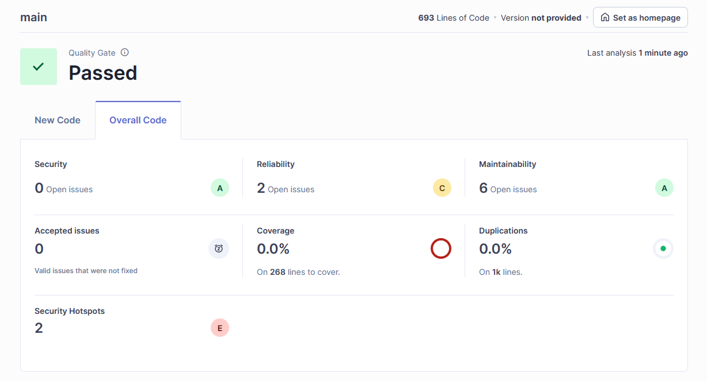
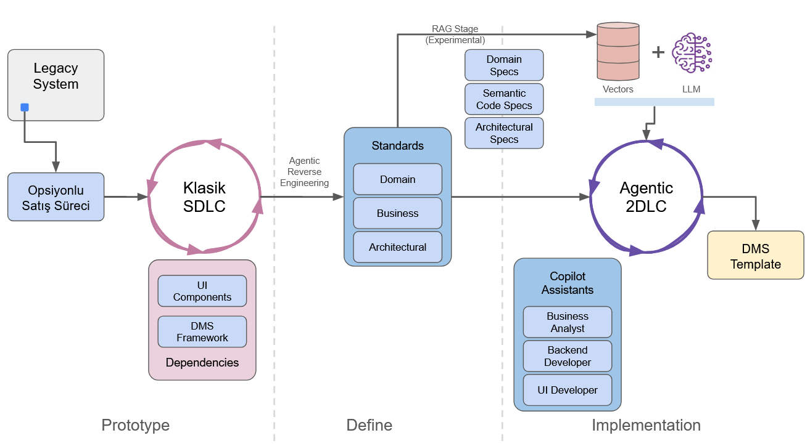
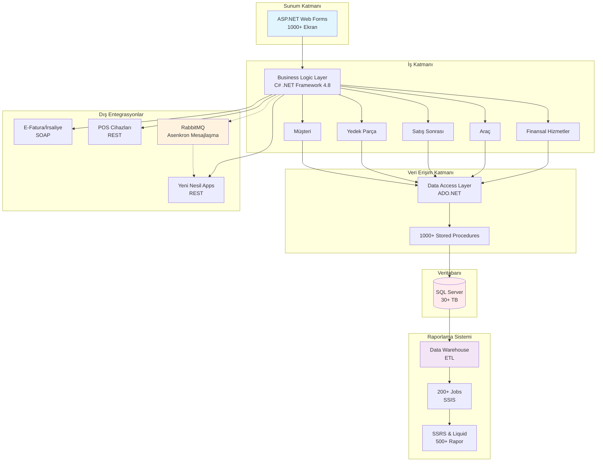
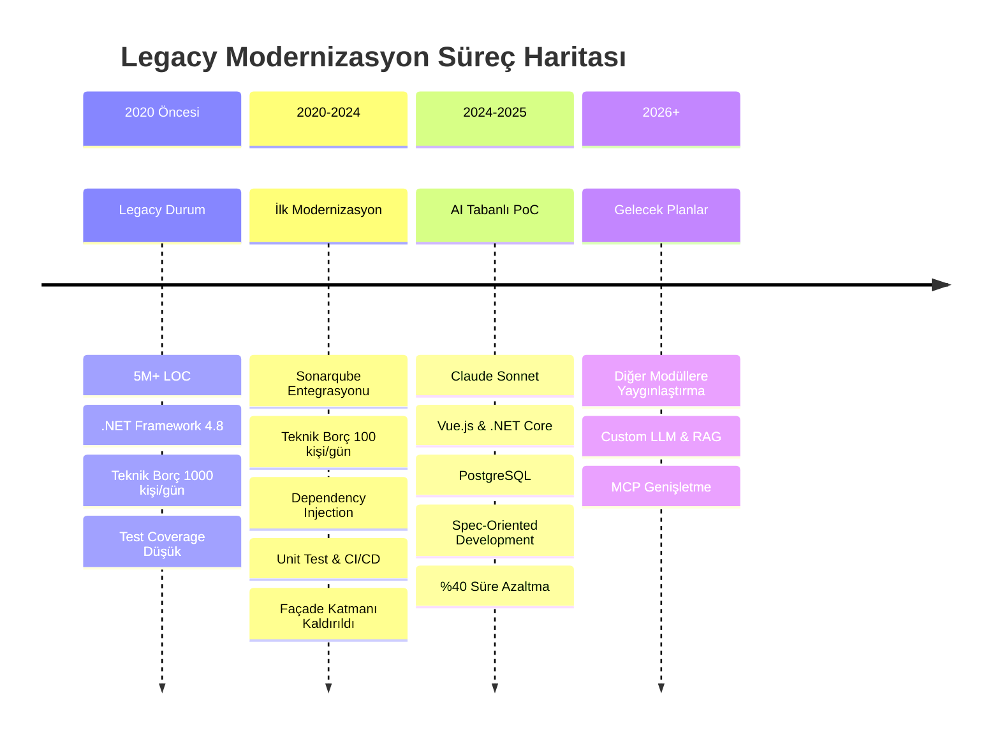
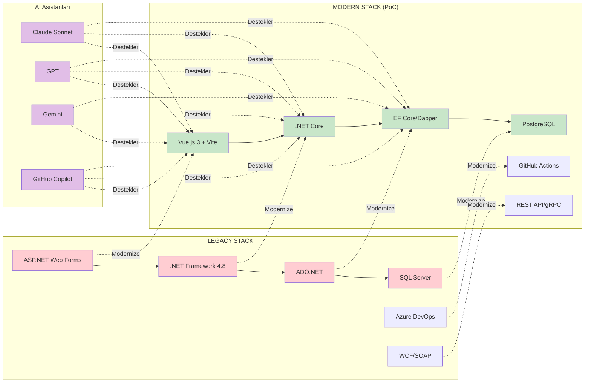

# Yapay Zeka, Yılların Koduna Karşı: AI Tabanlı Legacy Modernizasyonu

Legacy bir sistemi modernize etmek için yapay zeka teknolojilerinden nasıl yararlanıyoruz, ne gibi zorluklarla karşılaşıyoruz ve vardığımız sonuçlar...

- [Giriş](#yapay-zeka-yılların-koduna-karşı-ai-tabanlı-legacy-modernizasyonu)
  - [Legacy System](#legacy-system)
    - [Metriklerle Legacy Sistemimiz](#metriklerle-legacy-sistemimiz)
    - [Teknoloji Altyapısı](#teknoloji-altyapısı)
    - [Sistemdeki Genel Problemler (2020 Öncesi)](#sistemdeki-genel-problemler-2020-öncesi)
    - [Birincil Modernizasyon Çalışmaları (2020 - 2024)](#birincil-modernizasyon-çalışmaları-2020---2024)
    - [Motivasyon](#motivasyon)
    - [Riskler](#riskler)
    - [PoC Çalışma Stratejisi](#poc-çalışma-stratejisi)
      - [Geliştirme Süreci](#geliştirme-süreci)
      - [Deneyimler](#deneyimler)
        - [Sonarqube Taramaları](#sonarqube-taramaları)
        - [Sonarqube Taraması için Notlar](#sonarqube-taraması-için-notlar)
      - [Çalışma Sırasında Arada Yazılan Yardımcı Araçlar](#çalışma-sırasında-arada-yazılan-yardımcı-araçlar)
      - [Teknik Özet](#teknik-özet)
    - [Sonuçlar](#sonuçlar)
    - [Sonraki Planlar ve Hedefler](#sonraki-planlar-ve-hedefler)

## Legacy System

Milenyum başında geliştirilmeye başlanmış olan bayi yönetimi sistemi *(Dealer Management System - DMS)*, tamamen **Microsoft .NET** teknolojileri üzerine kurgulanmıştır. Bu nedenle .NET Framework'ün zaman içerisindeki değişimine bağlı olarak yer yer modernize edilmiş ve güncellenmiştir. Şu anda **.NET Framework 4.8** sürümünü kullanmaktadır. Sistem, bayi operasyonlarını yönetmek için kritik öneme sahip birçok modül içermektedir. Tabii Microsoft'un .NET Framework için olan desteği 2029 yılında sona erecektir. Bu nedenle, sistemin gelecekteki sürdürülebilirliği için modernizasyon kaçınılmazdır.

Genel olarak katmanlı mimari *(Layered Architecture)* modeline göre düzenlenmiş bir sistemdir. Presentation, Business Logic Layer ve **Data Access Layer** olmak üzere üç ana katmandan oluşan bir mimari üzerine kurgulanmıştır. Daha önceden var olan Façade katmanı ilk modernizasyon çalışması kapsamında kaldırılmıştır. Sistem Microsoft SQL Server veritabanı kullanmaktadır. İş kuralları ve süreçleri modül bazında son derece karmaşık ve içiçe geçmiş olabilir. Bu noktada SQL Server'ın stored procedure avantajları gözetilerek iş kuralları ve süreçlerin bir kısmı veritabanı katmanında da uygulanmıştır. Dolayısıyla kod ve veritabanına yayılmış iş kuralları ve süreçleri mevcuttur.

Onlarca yıllık bir uygulama söz konusu olduğundan altı milyon satırdan fazla bir kod tabanı söz konusudur. Binlerce ekran, yüzlerce stored procedure, tera baytlarca veri, onlarca servis beş ana modül etrafında birleşir. Bu modüller finansal hizmetler, araç, satış sonrası hizmetler, yedek parça, müşteri olarak sıralanabilir. Sistem, yüzlerce bayi tarafından kullanılmakta olup, milyonlarca müşteriye hizmet vermektedir.

Sistemle entegre çalışan birçok uygulama vardır. Örneğin ayrı bir raporlama sistemi bulunmaktadır. Bu sistem Data Warehouse mimarisi üzerine kurulmuş olup, ETL süreçleriyle ana sistemden veri çekmektedir. Raporların hazırlanması için planlanmış işler *(Scheduled Jobs)* kullanılır. 200'den fazla Job vardır ve bunların bazılarının çalışma süresi saatler mertebesindedir. Job'ların çoğu doğrudan Stored Procedure işletmekle kimisi de Microsoft'un **SSIS** *(SQL Server Integration Services)* hizmetleri şeklinde çalıştırılmaktadır. Bazı raporlar anlık üretilebilen türdedir ve bunlar için Liquid rapor şablonları kullanılmaktadır. Daha önceki dönemlerde Microsoft'un SSRS *(Microsoft SQL Server Reporting Services)* raporları da kullanılmıştır.

Sistem aynı zamanda regülasyonlar içeren dış servislere de bağımlılıklar içerir. Örneğin, elektronik faturalama ve irsaliye sistemleri, POS tabanlı ödeme cihazları, kurum için yazılmış yeni nesil uygulamalar vb. Bu sistemlerde haberleşme için ağırlıklı olarak SOAP ve REST tabanlı web servisleri kullanılmaktadır. Ana sistemden dışarıya açılan fonksiyonellikler içinse  XML Web Servisler ve WCF servisleri mevcuttur. Ayrıca yeni nesil uygulamaların ihtiyaç duyduğu veya karşılıklı olarak dahil olunması gereken süreçlerde asenkron mesajlaşma altyapısı bulunmaktadır. Bunun için **RabbitMQ** tercih edilmiştir. Modüller de kendi aralarında kullandığı ortak süreçlere sahiptir. Ortak ve tek bir veritabanı sistemi olduğundan modüller arası veri paylaşımı doğrudan veritabanı katmanından ve iş nesneleri üzerinden yapılmaktadır.

Uygulamanın dağıtımı ilk zamanlarda kurum içi geliştirilmiş bir uygulama tarafından zaman bazlı planlamalara bağlı kalınarak yapılmaktaydı. Son yıllarda yapılan modernizasyon çalışmaları kapsamında DevOps prensiplerine uygun olarak Azure DevOps üzerinden yürütülmektedir. Git tabanlı repolar kullanılmakta ve CI/CD süreçleri Azure DevOps Pipelines ile yönetilmektedir. Branch stratejisi olarak **Git Flow** tercih edilmiştir. Buna göre feature bazlı geliştirmeler yapılmakta, sprint bazlı release'ler oluşturulmakta ve ana branch'lere merge edilmektedir.

### Metriklerle Legacy Sistemimiz

Aşağıdaki tablo sistemimizin bazı metriklerini özetlemektedir:

| **Metrik** | **Değer** |
| --- | --- |
| **Kod Satırı Sayısı** | 6,000,000+ |
| **Ekran Sayısı** | 1,000+ |
| **Stored Procedure Sayısı** | 10,000+ |
| **Veri Tabanı Boyutu** | >30 TB |
| **Entegre Uygulama Sayısı** | 50+ |
| **Kullanıcı Sayısı** | 10,000+ |
| **Modül Sayısı** | 5 |
| **Rapor Sayısı** | 500+ |
| **Job Sayısı** | 200+ |

### Teknoloji Altyapısı

| **Katman** | **Teknoloji** |
| --- | --- |
| **Sunum Katmanı** | ASP.NET Web Forms |
| **İş Katmanı** | C# (.NET Framework) |
| **Veri Erişim Katmanı** | ADO.NET |
| **Veritabanı** | Microsoft SQL Server |
| **Entegrasyon** | WCF, SOAP, REST |
| **Mesajlaşma** | RabbitMQ |
| **Raporlama** | SSRS, Liquid Rapor |
| **Dağıtım** | Azure DevOps |

### Sistemdeki Genel Problemler (2020 Öncesi)

Var olan sistem yüksek müşteri memnuniyeti sağlamasına ve ihtiyaçlara tam olarak cevap vermesine rağmen gelişen teknolojiler ve artan iş gereksinimleri nedeniyle çeşitli zorluklarla karşılaşmıştır. Bu zorluklar ürünün modernizasyonu, farklı bir mimariye geçilmesi veya parçalara ayrılarak dağıtımı noktasında engeller oluşturmaktadır. Genel hatları ile bu zorluklar şöyle özetlenebilir:

- Zamanla önyüz formlarına karışan iş kuralları ve süreçler
- Kod tabanında biriken teknik borçlar
- Test edilebilirliğin düşük olması
- Geliştirilen müşteri taleplerine ait kurumsal hafızanın zamanla kaybolması
- Modüller arası sıkı bağımlılıklar ve zayıf soyutlamalar
- Yüksek lisanslama maliyetleri

### Birincil Modernizasyon Çalışmaları (2020 - 2024)

Modernizasyon ihtiyaçlarının netleştirilmesi için 2020 öncesinde birçok **fizibilite** çalışması gerçekleştirilmiş ve var olan durum detaylı raporlarla özetlenmiştir. Yeni mimari modellere geçmek ve modüllerin bağımsız olarak çalıştırılabilmesi stratejik hedef olarak belirlenmiştir. Bu kapsamda ilk uzun soluklu **IT4IT** çalışması 2020 yılında başlatılmıştır. Bu çalışmada bir yol haritası çıkartılmış ve aşağıdaki ana adımlar atılmıştır.

- **Sonarqube** ile kod kalitesinin düzenli olarak ölçümlenmesi ve raporlanması sağlanmıştır.
- **Teknik borçlar** 1000 kişi gün maliyetinden 100 kişi gün altına düşürülmüş yer yer sıfıra indirilmiştir.
- **Façade** katmanı kaldırılmıştır.
- **CBL** katmanındaki fonksiyonellikler soyutlanmış ve ayrı bir katmana taşınmıştır.
- Tüm bileşenler için **dependency injection** altyapısı kurulmuştur *(**Windsor Castle**)*.
- **Unit testler** yazılmaya başlanmış ve **code coverage** değerlerinin kabul edilebilir seviyelere gelmesi sağlanmıştır.
- **CI/CD** süreçleri iyileştirilmiş ve otomasyon oranı artırılmıştır.

Bu modernizasyon çalışmaları hali hazırda devam etmektedir ancak asıl stratejik hedeflere ulaşma noktasında ürünün sıfırdan yazılma maliyetinin çok yüksek olması nedeniyle yeni yaklaşımlar araştırılmaya başlanmış ve bu kapsamda yapay zeka tabanlı modernizasyon çözümleri mercek altına alınmıştır. Yazının bundan sonraki kısımlarında son dokuz aylık dönem içerisinde gerçekleştirilen yapay zeka tabanlı modernizasyon çalışmaları anlatılmakta olup sonuçlar ve gelecek planları paylaşılmaktadır.

### Motivasyon

Sistemin karmaşıklığı, büyüklüğü ve kritik iş süreçlerini içermesi nedeniyle geleneksel modernizasyon yöntemleriyle ilerlemek çok uzun sürecek ve yüksek maliyetli olacaktır. Yapay zeka tabanlı modernizasyon çözümleri, kod analizi, otomatik refaktörizasyon, test otomasyonu ve hatta kod üretimi gibi alanlarda önemli avantajlar sunarak bu süreci hızlandırabilir ve maliyetleri düşürebilir. Ayrıca, yapay zeka destekli araçlar, kodun karmaşıklığını daha iyi anlayarak teknik borçları tespit edebilir ve önceliklendirebilir, böylece modernizasyon sürecini daha etkili hale getirebilir.

### Riskler

Yapay zeka tabanlı teknolojilerin gelişimi ve vaat ettikleri çok cazip görünse de büyük çaplı ve karmaşık kurumsal çözümlerde ele alınmasının bir **PoC** *(Proof of Concept)* çalışmasıyla başlaması ve sonuçların dikkatle değerlendirilmesi gerekmektedir. Bu kapsamda aşağıdaki riskler göz önünde bulundurulmuş ve süreç içerisinde bu riskleri engelleyecek bir takım çalışmalar da değerlendirilmiştir.

- Yapay zeka tabanlı araçların kodun karmaşıklığını tam olarak anlayamaması ve kritik iş süreçlerini doğru şekilde analiz edememesi.
- Otomatik refaktör işlemlerinde hatalı düzenlemeler önermesi.
- Kaynak olarak kullanılan bilgilerin veri sızıntısına neden olabilmesi.
- Halusinasyon sebebiyle yanlış önerilerde bulunması.
- İnsan denetimi olmadan yapılan değişikliklerin beklenmedik sonuçlara yol açması.
- Yapay zeka tabanlı araçların mevcut kod tabanıyla entegrasyon sorunları yaşaması.
- Yapay zeka tabanlı araçların öğrenme sürecinde zaman alması ve başlangıçta düşük performans göstermesi.

> Güncelleme: Gelinen noktada yukarıdaki risklerin minimize edilmesi için RAG *(Retrieval Augmented Generation)* düzeneği, *Guardrail*, *Red Team* gibi yaklaşımlar sürece dahil edilmiştir. Vekil ajan çıktıları her daim insan denetimine tabidir.

## Level 0: Birinci Aşama

İlk etapta bir **PoC** çalışması ile başlanmasına karar verilmiş ve belli bir modülün orta karmaşıklıkta iş süreçleri barındıran bir alt bölümünün sıfırdan, lisansı alınmış yapay zeka modelleri kullanılarak yeniden geliştirilmesine karar verilmiştir.

Ağırlıklı olarak **Anthropic**'in **Claude Sonnet** modeli tercih edilmiştir. Bunun en büyük sebebi diğer modellere göre daha tutarlı kodlar üretmesi ve **halüsinasyon** oranının daha düşük olduğunun gözlemlenmesidir. Süreçte **front-end** tarafında **Nuxt** ve **Vite**, **back-end** tarafında ise **.NET Core** kullanılmasına karar verilmiştir. Özellikle ön yüz tarafında kurum için geliştirilen özel komponentler tercih edilmiştir. Veri tabanı tarafında **PostgreSQL**'de karar kılınmış ve kod tarafında **Entity Framework** ile **Dapper** entegrasyonları tercih edilmiştir. **Authentication/Authorization** için halihazırda diğer yeni nesil kurum içi uygulamaların da kullandığı servisler tercih edilmiş ve **Keycloak** ile devam edilmiştir. Kod tabanı **GitHub**'a alınmış ve **CI/CD** hattında **GitOps** kullanılarak otomatikleştirilmiştir. Kod kalitesi ve güvenlik taramaları için **Sonarqube** entegre edilmiştir. **Backend** taraf ile **front-end** arası haberleşme yine **REST API** üzerinden sağlanmış ancak özel entegrasyon noktaları için gerekli soyutlamalar da yapılmıştır. Bu sayede örneğin **gRPC** tabanlı noktalarla entegre olunabilmiştir. **Backend** tarafta kurum içi geliştirilmiş ve **cross-cutting concern**'leri de ele alan bir framework kullanılmıştır. Burada bağımlılıkların yönetimi için **.NET**'in dahili **dependency injection** altyapısı kullanılmıştır. Yeni yazılan **PoC** uygulamasında **legacy** sistemden hiçbir parçanın yer almamasını ve her şeyin sıfırdan tasarlanmasına özellikle dikkat edilmiştir.

### Geliştirme Süreci

Geliştirme sırasında ağırlıklı olarak **Visual Studio Code** kullanılmıştır. İlk etapta doğrudan **Copilot** chat penceresi üzerinden **prompt** vererek ilerlemek yerine, yazılması istenen parçalar için **markdown** belgeleri hazırlanarak ilerlenmiştir. Öncelikli model olarak **Claude Sonnet** kullanılırken, ancak bazı durumlarda **GPT**, **Gemini** ve **Grok** ile de kıyaslamalar yapılmıştır. Burada özellikle deneysel aşamada olan modeller şirket verilerinin gizliliğini korumak için tercih edilmemiştir. Geliştirme sürecindeki safhaları aşağıdaki gibi ana hatlarıyla özetleyebiliriz:

- **Spec-Oriented** yaklaşımı benimsendi ve yapay zeka asistanlarına kullandırılan dokümanlar hazırlandı.

```text
- docs
  - architectural-overview (Sistemin genel mimari yapısı, kullanılan teknolojiler, kodlama standartları, bileşene ait rehber dokümanlar, çoklu dil desteği için dokümanlar vb yer alır)
  - business (Burada feature baslı user story'ler yer alır)
  - domain-model (DDD kurgusunda entity, value object, aggregate root dokümanları ile süreç elemanları özetlenir)
  - ui (mock-up ekranlarının HTML formatlı hallerinin yer aldığı klasördür)
  - static-data (Sabit veriler, parametreler vb için dokümanlar yer alır)
  - prompts (uçtan uca API üretme, EF migration hazırlama ve işletme, uçtan uca Vue sayfası oluşturma gibi işlemler için yapay zeka asistanlarına kullandırılan prompt'ların yer aldığı klasördür)
```

- Yapay zeka asistanları ile etkileşim için **Copilot** üzerinde uzman **Agent**'lar tanımlandı: Senior Software Developer, UI/UX Expert, Senior Business Analyst, DevOps Engineer, QA Engineer gibi.
- Diğer modüllerin kolayca geliştirme yapmaya başlamaları için bir **dotnet template** projesi ve **CLI** aracı oluşturuldu. Bu sayede sıfırdan bir projeye başlayacaklar için gerekli spec doküman şablonlarını içeren, çalışır temel **back-end** ve **front-end** uygulamalarını otomatik olarak oluşturan araçlar sağlandı.
- **Domain** odaklı geliştirilmiş **Framework** ve **Source Code Generator** kütüphaneleri kurum içi **NuGet** repolarına, benzer şekilde **Vue** bileşenleri de **npm** repolarına alındı.
- Üretilen çözüm alt yapısı belirli bir olgunluğa ulaştıktan sonra, kod kalitesi ölçümü için **Sonarqube** ile entegrasyon sağlandı. Ayrıca **SonarSource Sonarqube MCP Server** ile entegre olundu ve **VS Code** arabiriminden çıkmadan yerleşik agent'lar yardımıyla, bulgu analizi, yorumlama, düzeltme *(issue çözdürme, cognitive complexity düşürme, code-coverage değerlerini yükseltme)* gibi işlemler yapıldı.

### Deneyimler

Çalışma sırasında elde edilen deneyimlerimizi aşağıdaki gibi özetleyebiliriz.

- Yapay zeka asistanları ile etkileşimde doğru **prompt**'ların hazırlanması ve sürekli iyileştirilmesi kritik öneme sahip. Başlangıçta hazırlanan prompt'lar yeterince spesifik olmadığında, üretilen kodlar beklenen kaliteye ulaşmamış ve manuel müdahale ihtiyacı artmıştır. Bu nedenle **spec** dokümanlarının detaylandırılması ve örnek kod parçalarının sunulması önemli bir rol oynamıştır. Prompt verilirken **Context** ilgili konuları dahil edilecek yapılandırılmış kaynaklarla desteklenmesinin önemli olduğu görülmüştür.
- Yapay zeka asistanlarının ürettiği kodların kalitesi, modelin eğitildiği veri setine ve modelin kapasitesine bağlı olarak değişiklik göstermektedir. Bu nedenle, farklı modellerin karşılaştırılması ve en uygun olanın seçilmesi gerekliliği ortaya çıkmıştır.
- Kod üretimi ve analiz çıkartılması **Copilot** ajanlarına alındıktan sonra daha tutarlı sonuçlar elde edildiği gözlemlendi. Taleplerin yeni **feature branch**'lerde oluşturulması, **review** için insan denetimine gönderilmesi, review sırasında verilen yorumlara karşılık ek düzeltmeler yapılması ve **Pull Request** süreci işletilerek ilerlenmesi daha güvenli hissetmemizi sağladı.
- Özellikle **domain** içerisinde yer alacak **entity**, **value object**, **aggregate root** gibi yapıların doğru şekilde modellenmesi ve **spec** olarak dokümante edilmesi, belli standartlar çerçevesinde kod üretilmesi açısından faydalı oldu. Yapay zeka asistanları bu ilişkilerden yararlanarak genel senaryoları oluşturmakta *(örneğin, araç siparişi oluşturma, müşteri şikayeti alma, vb)* daha başarılı oldular.
- Küresel bir standartta olmayan bazı alanlarda detaylı **spec** dokümanları olmadığında tutarlı sonuçlar elde etmekte zorlandık. Örneğin özel bileşenlerden oluşan **UI** kütüphanelerinde, yapay zeka asistanlarının doğru kod parçalarını üretmesi için detaylı örnekler ve kullanım şekilleri sunmak gerekti. Bu amaçla bileşen setleri için nasıl kullanıldığına dair dokümanlar hazırlandı ve örnek kod parçaları sunuldu. Bu aslında bir **RAG** *(Retrieval Augmented Generation)* yaklaşımı için de bize yol gösterici oldu. *(RAG yaklaşımı ile domain'e özgü bilgi ve dokümanların yapay zeka asistanlarına sunulması, daha doğru ve tutarlı sonuçlar elde edilmesini sağlar)*
- **Sonarqube** ile yapılan ilk taramalar, agent bazlı geliştirmelerde kod tabanı hatasız derlense dahi bir takım teknik borçların ortaya çıktığını gösterdi. Dolayısıyla insan denetimi ve müdahalesi olmadan tamamen hatasız bir sürecin işletilmesinin POC çalışmasının yapıldığı zaman itibariyle pek mümkün olmadığı gözlemlendi. Ancak, **Sonarqube MCP Server** ile entegrasyon sayesinde, yapay zeka asistanlarının bu bulguları analiz ederek düzeltme önerileri sunması ve hatta bazı düzeltmeleri otomatik olarak yapması sağlandı. Bu da sürecin hızlanmasına ve kod kalitesinin artırılmasına katkıda bulundu.

#### Sonarqube Taramaları

Bu çalışmada mini POC olarak yer alan ve tamamen YZ araçları güdümünde ilerlenen bir proje söz konusu. Demo projesinde oldukça küçük bir kod tabanı ile çalışırken Sonarqube'un ilk tarama sonuçları aşağıdaki gibidir.



ve ilk taramadaki bazı bulgulara ait başlıklar;

- Constructor has 14 parameters, which is greater than the 7 authorized.
- Method has 13 parameters, which is greater than the 7 authorized.
- Rename class 'VIN' to match pascal case naming rules, consider using 'Vin'.
- Prefer using 'string.Equals(string, StringComparison)' to perform a case-insensitive comparison, but keep in mind that this might cause subtle changes in behavior, so make sure to conduct thorough testing after applying the suggestion, or if culturally sensitive comparison is not required, consider using 'StringComparison.OrdinalIgnoreCase'
- Await RunAsync instead.

gibi.

ikinci tarama sonuçlar;


#### Sonarqube Taraması için Notlar

```bash
# Token oluşturduktan sonra aşağıdaki komutla tarama yapılabilir
dotnet sonarscanner begin /k:"VehicleInventory-Backend" /d:sonar.host.url="http://localhost:9001" /d:sonar.token="${SONAR_TOKEN}"

dotnet build

dotnet sonarscanner end /d:sonar.token="${SONAR_TOKEN}"
```

### Çalışma Sırasında Arada Yazılan Yardımcı Araçlar

Kurum için geliştirilen PoC çalışması sırasında geliştirme hızımızın önemli ölçüde arttığını fark ettik ve birkaç yardımcı araç daha yazdık:

- **Domain Sözlüğü:** Ürün paydaşlarının ortak bir terminoloji kullanmasını sağlamak için bir domain sözlüğü aracı geliştirdik. Bu araç, yapay zeka asistanlarının doğru terimleri kullanmasını kolaylaştırdı ancak daha da önemlisi paydaşların ortak domain dili *(Ubiquitous Language)* oluşturmasında rol oynayabileceğini gösterdi.
- **MCP *(Model Context Protocol)*:** Template kullanımı haricinde kullanıcı hikayeleri *(User Story)* ve iş kurallarını barındıran analiz dokümanlarını minimum hatada oluşturmak için bir **MCP** sunucusu ve gerekli **API** endpoint'leri geliştirildi. İlgili **MCP server** **VS Code** ortamlarına da adapte edildi ve böylece analist veya yazılım geliştiricilerin, yapay zeka asistanlarıyla bu **domain** özelinde konuşabilmeleri ve domain kurallarına uygun çıktılar alabilmeleri için deneysel bir ortam sağlanmış oldu.
- **Tersine Mühendislik Aracı:** Var olan **legacy** sistemdeki belirli kod parçalarının analiz edilerek, iş kurallarının ve süreçlerin çıkarılmasını sağlayan bir tersine mühendislik aracı geliştirildi. Bu araç ile var olan bazı iş kuralları için doküman hazırlanması, gözden geçirilmek kaydıyla yeni sisteme adapte edilmeleri ile ilgili test ortamları sağlanmış oldu.

> Güncelleme: Yapay Zeka araçlarındaki yeni gelişmeler sonrası buradaki araçlar rafa kaldırılmıştır.

## RAG *(Retrieval Augmented Generation)* Düzeneği

Bu demo projesinde basit bir RAG düzeneği vardır. Sadece domain ile ilgili sorulara cevap vermesi planlanan türden bir chatbot senaryosu içerir. **RAG** isimli solution içerisinde bu amaçla iki projeye yer verilmektedir.

- **DocChunker:** Bu proje, domain'e özgü dokümanları parçalara ayırarak vektörleştirmek ve bir koleksiyona kaydetmek için kullanılan araçları içerir. Bu sayede yapay zeka asistanlarının bu dokümanlara erişerek daha doğru ve tutarlı cevaplar üretmesi sağlanır.
- **RAGChatbot:** Bu proje, kullanıcıların domain'e özgü sorular sormasına ve yapay zeka asistanlarının bu sorulara cevap vermesine olanak tanır. Yapay zeka asistanları, **DocChunker** tarafından oluşturulan vektör koleksiyonunu kullanarak ilgili dokümanlara erişir ve bu dokümanlardan yararlanarak cevaplar üretir.

Düzenekte local dil modelleri kullanılmaktadır. Bu amaçla **LM Studio** üzerinden text embedding için `text-embedding-nomic-embed-text-v1.5` ve muhakeme *(reasoning)* için `meta-llama-3-8b-instruct` modelleri tercih edilmiştir. Vektör veritabanı olarak **QDrant** kullanılmıştır.

Chatbot uygulamasına ait örnek bir çalışma zamanını aşağıda görebilirsiniz.


### Teknik Özet

Yukarıdaki süreçte kullanılan başlıca teknolojiler ve araçlara ait özet bilgileri aşağıdaki tabloda bulabilirsiniz:

| **Kategori** | **Teknoloji / Araç** |
| --- | --- |
| **Yapay Zeka Modelleri** | Anthropic Claude Sonnet, OpenAI GPT, Google Gemini, Grok |
| **YZ Asistanları** | GitHub Copilot |
| **Metodoloji** | Spec-Oriented Development, RAG *(Deneme Aşamasında)* |
| **Front-End Teknolojileri** | Nuxt, Vite, Vue Router |
| **Back-End Teknolojileri** | .NET Core, C# |
| **Veri Tabanı** | PostgreSQL/Microsoft SQL Server |
| **ORM** | Entity Framework, Dapper |
| **Auth/Authorization** | Keycloak |
| **CI/CD** | GitHub Actions |
| **Kod Kalitesi ve Güvenlik** | Sonarqube *(MCP Server ile birlikte)*, Copilot |

## Sonuçlar

Bu çalışma kapsamında elde edilen başlıca sonuçlar aşağıdaki gibi özetlenebilir:

- Yapay zeka tabanlı modernizasyon süreci, geleneksel yöntemlere kıyasla geliştirme süresini %40 oranında azalttı.
- Üretilen kodların kalitesi, manuel olarak yazılan kodlarla karşılaştırıldığında benzer seviyelerde bulundu.
- Teknik borçların azaltılması ve kodun daha modüler hale getirilmesi sağlandı.
- Yapay zeka asistanlarının doğru şekilde yönlendirilmesi ve etkileşimde bulunulması, sürecin başarısında kritik rol oynadı.
- Ancak, bazı durumlarda yapay zeka asistanlarının ürettiği kodların gözden geçirilmesi ve manuel müdahale gerektirdiği görüldü.
- Şu an ve yakın vadede mutlak suretle insan denetimli bir sürecin işletilmesi gerektiği gözlemlendi.

## Sonraki Planlar ve Hedefler

- **PoC** çalışmasının başarıyla tamamlanmasının ardından, yapay zeka tabanlı modernizasyon sürecinin diğer modüllere de genişletilmesi planlanmakta *(Güncelleme: Tüm modüller geliştirmelerine başlamış durumda)*
- Yapay zeka asistanlarının eğitiminde kullanılacak veri setlerinden hareketle daha küçük ve **domain**'e özgü dil modelleri *(Custom LLM)* oluşturulması değerlendirilmekte.
- **RAG** *(Retrieval Augmented Generation)* yaklaşımının daha etkin kullanılması için doküman yönetim sistemlerinin entegrasyonu planlanabilir. *(Güncelleme: RAG yaklaşımı için gerekli altyapı ve süreçlerin oluşturulması için çalışmalara başlandı)*
- Süreçte kullanılan **prompt**'ların sürekli iyileştirilmesi ve optimize edilmesi için bir geri bildirim mekanizması oluşturulması faydalı olacaktır.
- **MCP** tabanlı etkileşimlerin daha da geliştirilmesi ve yaygınlaştırılması düşünülebilir.
- Mutlak suretle çıktıların maliyeti ölçümlenmeli ve insan denetimi için gereken kaynaklar optimize edilmelidir.
- Hassas bilgilerin korunması, vekil ajanların güvenliğinin sağlanması ve olası veri sızıntılarının önlenmesi için ek güvenlik önlemleri alınmalıdır. *(GuardRail, Red Team gibi yaklaşımlar değerlendirilmektedir)*

---

## PoC Çalışma Stratejisi

Bu kapsamlı çalışmada güncel olarak uygulanan metodoloji aşağıdaki grafikte özetlenmiştir.

İlk olarak legacy sistemin uygulanabilir küçük bir parçası senaryoya dahil edilmiştir. Burada dış entegrasyon bağımlılıklarının minimum seviyede tutulmasına özen gösterilmiştir. Amaç klasik yazılım geliştirme yaşam döngüsünü *(SDLC)* kullanarak sıfırdan bir DMS prototipinin hazırlanmasıdır. Bu süreçte projeye yeniden yazılmış domain bazlı framework ve görsel komponent bileşenleri eklenmiştir. Ayrıca api üretimi için daha önceki projelerde denenmiş olan Source Generator'lar da dahil edilmiştir.

Bu çalışmada sürecin yeni nesil framework ve bileşen setleri ile başarılı şekilde icra edilmesi en önemli hedeftir. **Prototype** safhası olarak ele alınan bu süreç sonlandığında yapay zeka modellerinden tersine mühendislik yöntemleri ile var olan mimariyi analiz etmesi ve standartları birer **spec** dokümanı olarak oluşturması istenmiştir. **Define** olarak belirlediğimiz bu aşamada amaç, sonraki üretimler için yapay zeka araçlarına verilebilecek standartların ortaya çıkartılmasıdır. Sonuç olarak domain kuralları, nesneler arası ilişkiler, mimari kararlar ve kodun semantik bağlamlarının yer aldığı şablonlar *(templates)* ortaya çıkmıştır.

Bu noktadan itibaren **Implementation** safhasına geçilmiştir. Söz konusu safhada paralel olarak iki ayrı hat üstünden ilerlenmiştir. Maliyet açısından görece daha ucuz olan hatta **GitHub Copilot** üzerinden yapay zeka rolleri tanımlanmıştır. İş analisti, yazılım geliştirici, test mühendisi gibi rollerden aşağıdakilerine benzer görevler icra etmeleri istenmiştir.

- Birkaç cümle ile tariflenen bir sürecin analiz dokümanının hazırlanması.
- Hazırlanan analiz dokümanına istinaden API ve backend kodlarının yazılması.
- Domain modellerinin kurgulanması ve migration planlarının işletilmesi.
- Wireframe tasarımlarına göre önyüzlerin geliştirilmesi ve API noktalarına bağlanması.

Paralel olarak yürütülen diğer süreçte ise dil modellerinin domain sınırları içerisinde kalarak görevler icra etmesi ve asistan hizmet desteği sağlaması için bir **RAG** *(Retrieval Augmented Generation)* hattı oluşturulmuştur. Burada **text embedding** ve **vector** veritabanları için farklı ürünler kullanılmıştır. Ayrıca denemelerin çoğu local ortamlarda çalıştırılan dil modelleri üzerinden gerçekleştirilmiştir. Bu çalışmalar sırasında özellikle görev icrası öncesi prompt alan istemci uygulamalarda **Microsoft.SemanticKernel** çatısı ve bileşenlerinden yararlanılmıştır.



Çalışma sonucu elde ettiğimiz kriterler baktığımızda avantaj ve dezavantaj noktalarını aşağıdaki gibi özetleyebiliriz.

| **Pros** | **Cons** |
| --- | --- |
| Artan development hızı(%70) | Sarp anlama eğrisi |
| "Up to date" dokümantasyon | Token/dolayı enerji maliyeti |
| Proaktif düzenleme fırsatları | İdeal senaryoda belirsiz kurgu(setup) maliyeti |
| Yenilenen domain kültürü | Olası teknik borçlanma |

## Güncelleme: 2026 - Nisan

- Modüller kendi repolarında geliştirmelere başlamış durumdadır.
- Uçtan uca feature geliştirebilen ajan eklenmiştir.
- Ajanların sorumlulukları netleştirilmiş ve görev tanımları güncellenmiştir.
- Tüm vekil ajanlara gerekli yetkinlikler *(SKILLS)* yüklenmiştir.
- Prompt odaklı bazı geliştirme ihtiyaçlarında **plan** modunda ilerlenmiştir.

---

## Yardımcı Diagramlar

> Bu bölümde dokümanı destekleyici bazı diagramlar yer almaktadır.

### Legacy Sistem Mimarisi



### Modernizasyon Yol Haritası



### PoC Modernizasyon Stack Karşılaştırması



### Spec-Oriented Development İş Akışı


## Sözlük

> Dokümanda geçen terimlerin tanımları ve açıklamaları için bu bölüme bakabilirsiniz.

### Teknoloji Terimleri

- **AI Agent / Copilot Agent**: GitHub Copilot üzerinde tanımlanmış, belirli roller ve sorumluluklar verilen yapay zeka asistanları (örn: Senior Developer, QA Engineer)
- **ADO.NET**: Microsoft'un veri erişim teknolojisi, veritabanı işlemleri için düşük seviyeli API sağlar
- **Aggregate Root**: DDD'de bir entity kümesinin kök elemanı, tutarlılık sınırlarını belirler
- **ASP.NET Web Forms**: Microsoft'un event-driven web uygulama geliştirme framework'ü
- **Claude Sonnet**: Anthropic firması tarafından geliştirilen büyük dil modeli, kod üretme konusunda güçlü
- **Cross-Cutting Concerns**: Loglama, güvenlik, transaction yönetimi gibi birçok katmanı ilgilendiren ortak fonksiyonellikler
- **Dapper**: Hafif, yüksek performanslı .NET için micro-ORM
- **DDD (Domain Driven Design)**: İş mantığını merkeze alan yazılım geliştirme yaklaşımı
- **Dependency Injection**: Bağımlılıkların dışarıdan enjekte edildiği tasarım deseni
- **Entity**: DDD'de benzersiz kimliği olan ve yaşam döngüsü takip edilen iş nesneleri
- **Entity Framework (EF)**: Microsoft'un Object-Relational Mapping (ORM) framework'ü
- **ETL (Extract, Transform, Load)**: Verilerin çekilmesi, dönüştürülmesi ve yüklenmesi süreci
- **gRPC**: Google tarafından geliştirilen yüksek performanslı RPC framework'ü
- **GitOps**: Git repository'sini infrastructure ve uygulama konfigürasyonları için tek doğruluk kaynağı olarak kullanan yaklaşım
- **Halüsinasyon**: Yapay zeka modellerinin gerçek olmayan veya yanlış bilgi üretmesi
- **Keycloak**: Açık kaynaklı Identity ve Access Management çözümü
- **Legacy System**: Eski teknoloji veya mimarilerle geliştirilmiş, uzun süredir çalışan sistemler
- **Liquid Template**: Shopify tarafından geliştirilen, güvenli ve esnek template dili
- **MCP (Model Context Protocol)**: AI modellerinin harici veri kaynaklarına erişimini standartlaştıran protokol
- **N-Tier Architecture**: Presentation, Business Logic, Data Access gibi katmanlara ayrılmış mimari
- **Vite**: Yeni nesil frontend build tool, son derece hızlı HMR (Hot Module Replacement) ve modern JavaScript özelliklerini destekler
- **Vue.js 3**: Progressive JavaScript framework, Composition API ve TypeScript ile modern kullanıcı arayüzleri geliştirmek için kullanılır
- **ORM (Object-Relational Mapping)**: Nesne ve veritabanı tabloları arasında mapping sağlayan teknoloji
- **PoC (Proof of Concept)**: Bir fikrin veya yaklaşımın uygulanabilirliğini test etmek için yapılan deneysel çalışma
- **PostgreSQL**: Açık kaynaklı, güçlü ilişkisel veritabanı yönetim sistemi
- **RAG (Retrieval Augmented Generation)**: AI modellerine harici bilgi kaynaklarından context sağlayan yaklaşım
- **SSIS (SQL Server Integration Services)**: Microsoft'un ETL ve veri entegrasyonu aracı
- **SSRS (SQL Server Reporting Services)**: Microsoft'un kurumsal raporlama platformu
- **Stored Procedure**: Veritabanında saklanan ve çalıştırılabilen SQL kod blokları
- **Value Object**: DDD'de kimliği olmayan, değerleriyle tanımlanan nesneler (örn: Money, Address)
- **Vue.js**: Progressive JavaScript framework, kullanıcı arayüzleri geliştirmek için kullanılır
- **WCF (Windows Communication Foundation)**: Microsoft'un servis tabanlı uygulamalar için framework'ü

### İş ve Süreç Terimleri

- **Bayi Yönetimi Sistemi (DMS)**: Otomotiv sektöründe bayi operasyonlarını yöneten kapsamlı yazılım sistemi
- **Code Coverage**: Test kodlarının kaynak kodunun ne kadarını kapsadığını gösteren metrik
- **Cognitive Complexity**: Kodun anlaşılma zorluğunu ölçen metrik
- **DevOps**: Yazılım geliştirme (Dev) ve IT operasyonlarını (Ops) birleştiren kültür ve pratikler
- **Domain**: Yazılımın çözdüğü iş probleminin alanı ve konusu
- **Feature Branch**: Yeni özellik geliştirmesi için açılan izole git dalı
- **Fizibilite**: Bir projenin teknik ve ekonomik olarak gerçekleştirilebilirliğinin araştırılması
- **IT4IT**: IT yönetimi için referans mimari framework'ü
- **Modernizasyon**: Eski sistemlerin yeni teknolojilere ve mimarilere taşınması süreci
- **Pull Request**: Kod değişikliklerinin review edilip ana branch'e alınması için yapılan istek
- **Refaktörizasyon**: Kodun davranışını değiştirmeden iç yapısını iyileştirme
- **Spec-Oriented Development**: Detaylı specification dokümanları ile yönlendirilen geliştirme yaklaşımı
- **Sprint**: Agile metodolojide sabit sürede planlanan çalışma periyodu (genellikle 1-4 hafta)
- **Technical Debt (Teknik Borç)**: Hızlı çözümler nedeniyle birikmiş, gelecekte düzeltilmesi gereken kod kalitesi problemleri
- **User Story**: Kullanıcı bakış açısından yazılmış fonksiyonel gereksinim

### Araçlar ve Platformlar

- **Azure DevOps**: Microsoft'un DevOps için sunduğu bulut platform (CI/CD, repo, boards vb.)
- **GitHub Actions**: GitHub'ın CI/CD automation servisi
- **GitHub Copilot**: GitHub ve OpenAI'ın geliştirdiği AI kod asistanı
- **Git Flow**: Git branching stratejisi (main, develop, feature, release, hotfix)
- **NuGet**: .NET için paket yöneticisi
- **npm**: Node.js ve JavaScript için paket yöneticisi
- **RabbitMQ**: Açık kaynaklı message broker, asenkron mesajlaşma için kullanılır
- **Sonarqube**: Kod kalitesi ve güvenlik analizi platformu
- **Visual Studio Code (VS Code)**: Microsoft'un popüler, hafif code editor'ü
- **Windsor Castle**: .NET için IoC container ve Dependency Injection framework'ü

---

## Demo Simülasyonu

Bu repoda, sunumda anlatılan **Spec-Oriented Development** yaklaşımını göstermek için basitleştirilmiş bir **Araç Envanter Yönetimi** modülü simülasyonu bulunmaktadır.

### Doküman Yapısı

```text
docs/
├── architectural-overview/     # Teknoloji stack, kodlama standartları, proje yapısı
├── business/                   # User story'ler (US-001, US-002)
├── domain-model/               # Entity ve Value Object tanımları
├── ui/                         # HTML mockup'lar
├── static-data/                # Enum'lar, marka/model listeleri
└── prompts/                    # AI asistanlarına kullandırılacak prompt'lar
```

### İçerik

- **2 User Story**: Araç ekleme ve listeleme
- **3 Domain Model**: Vehicle (Entity), VIN ve Money (Value Objects)
- **2 UI Mockup**: Araç ekleme formu ve liste sayfası
- **3 AI Prompt Template**: API endpoint, EF Migration, Vue component geliştirme
- **Coding Standards**: C# ve TypeScript/Vue için detaylı standartlar

### Kullanım

Bu dokümanlar **GitHub Copilot** veya diğer **AI** asistanlarına context olarak verilerek:

1. Backend API endpoint'leri geliştirilebilir
2. Database migration'ları oluşturulabilir
3. Frontend component'leri üretilebilir
4. Test senaryoları yazılabilir

Detaylı kullanım için: [`docs/prompts/README.md`](docs/prompts/README.md)

### Not

Bu simülasyon **eğitim ve sunum amaçlıdır**. Gerçek kurumsal uygulamanın kod ve verileri gizlilik nedeniyle paylaşılamamıştır.
